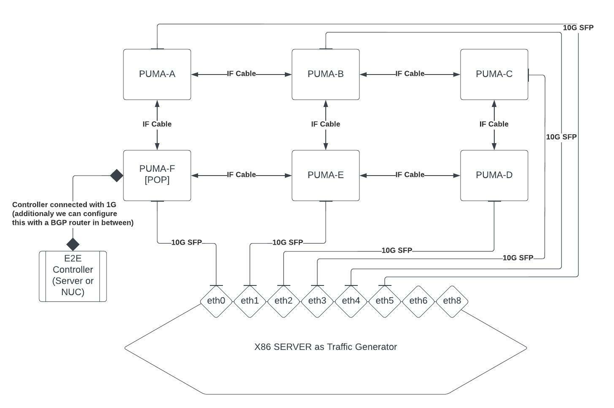
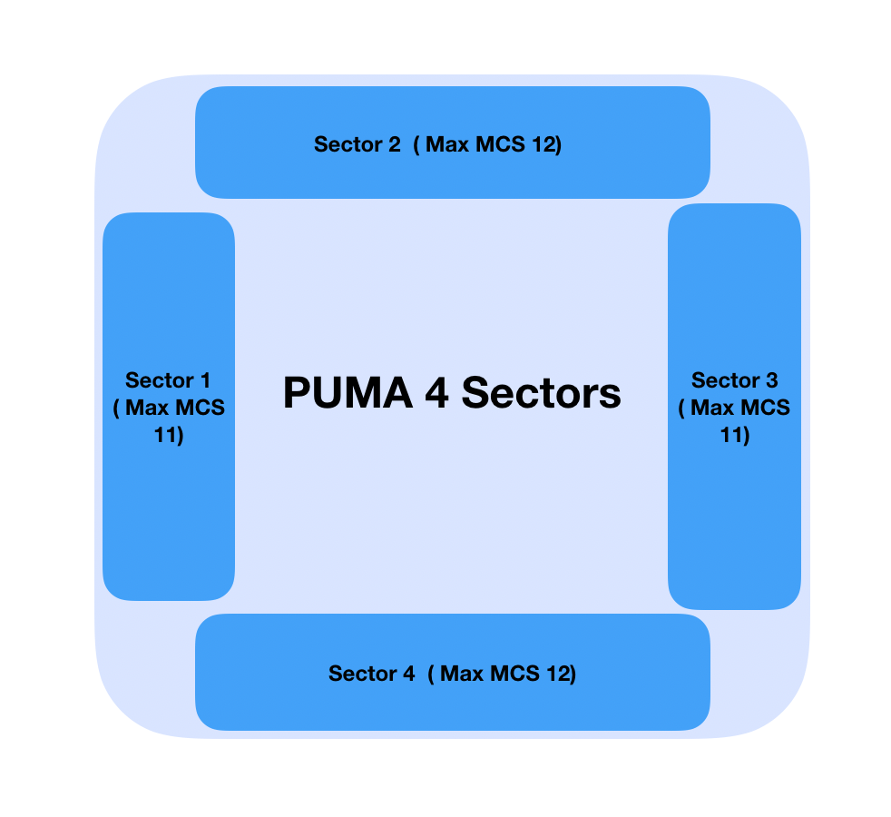

# Terragraph Test Plans
The test plans described below are designed for Puma hardware.

## Test Index
* [IBF](tests/IBF.md)
* [Association](tests/Association.md)
* [Throughput](tests/Throughput.md)
* [Link Adaptation](tests/Link_Adaptation.md)
* [Interference](tests/Interference.md)
* [802.1X](tests/802.1X.md)
* [WSEC](tests/WSEC.md)
* [Link Level Scheduler](tests/LLS.md)
* [Scans](tests/Scans.md)
* [SW Hybrid](tests/SW_Hybrid.md)
* [Y-Street](tests/Y_Street.md)
* [Z-Street](tests/Z_Street.md)
* [Coordinated Scheduling](tests/Coordinated_Scheduling.md)
* [E2E Controller](tests/E2E_Controller.md)
* [Stability](tests/Stability.md)
* [RFC 2544](tests/RFC_2544.md)
* [Routing](tests/Routing.md)
* [Prefix Allocation](tests/Prefix_Allocation.md)
* [QoS](tests/QoS.md)
* [Link Overloading](tests/Link_Overloading.md)

## Test Setups

### Setup Types
Common test setups include:
* P2P
* P2MP
* 4 sector PoP-2
* Multi-hop
* Y-Street

Other test-specific setups are described in the corresponding test descriptions.

Example of IF Figure-of-8 setup:

  

### Assumptions
* All setups will be connected to x86 traffic generator via copper & fiber
  switches.
* Default TCP congestion control protocol will be used.
* In E2E testing, most of the testing will be done using E2E REST API service.
  Minimal tests to validate TG CLI will be added.
* iPerf version 3.
* BI-directional data transfer for all tests.
* All traffic using x86 traffic generator.
* Wireless security ("wsec") is enabled.
* Bulk of tests using E2E.
* Open/R routing is used.

### General Definitions
* **Sector** - A Terragraph radio with full L1/L2 stack
* **Link** - Radio connection between 2 sectors
* **DUT** - Device Under Test
* **r2d2** - Command-line interface on each sector used to configure parameters
  of the driver/firmware.
* **PDU** - Power Distribution Unit
* **CPA/DPA** - Centralized Prefix Allocation, Deterministic Prefix Allocation
* **LFA** - Loop-Free Alternate path

## Puma Software Plan

### IF vs. RF Builds
Terragraph has the RF meta file from Qualcomm that allows us to generate our own
RF based Puma code. IF versions of the code are just delivered with the
different versions.

### Imix Traffic Definition
For IPv4 Imix is assumed to consist of a mixture of three packet sizes 40, 576,
1500 at a ratio of 7:4:1. This includes all headers from layer 2 and above. The
minimum IPv6 packet size is 40 Bytes IPv6 + 20 Bytes TCP header = 60 Bytes for
TCP and 40 Bytes IPv6 + 8 Bytes UDP header = 48 bytes for UDP. So we define our
Imix to be 64, 576, and 1500 at a ratio of 7:4:1. This is the layer 2 frames
size the data packet size will be different for UDP and TCP. Furthermore for
bidirectional tests the actual data stream will incorporate one reverse link ack
packet for approximately two forward link data packets. All this needs to be
taken into account whenc calculating iPerf measured data rates. Imix can be
generated using three iPerf streams where if we want the overall data rate to be
X Mbps then the stream rates are given by:

### Puma Block Diagram
The diagram below illustrates the 4 sectors and max supported MCS on Puma.

  

### General Known Coverage Gaps
* Limited packet sizes being tested
* Most throughput is constant rate (lack of bursty traffic)
* Most throughput is constant packet size (some Imix traffic size)
