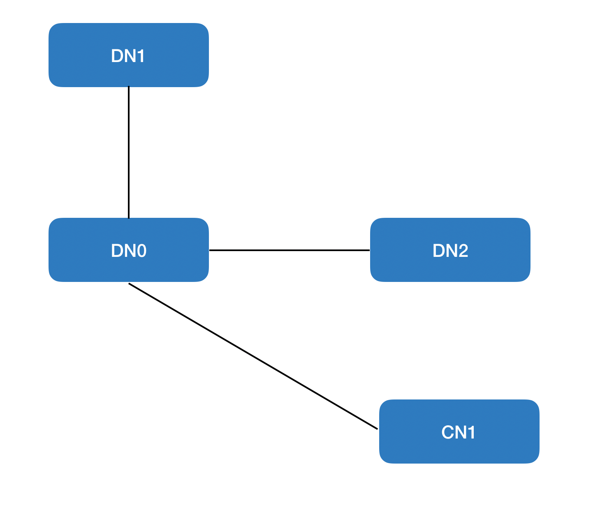
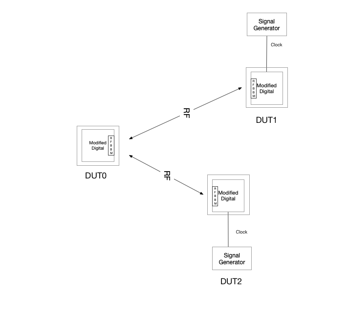

# Association Tests

## P2P

General notes on P2P association tests:
* These tests are done using `r2d2` commands
* Select appropriate before every association if not supported in software

### `PUMA_RF_AT-R2D2` Four Sector PoP Assoc
Description: Four P2P associations, one being on each sector

Test Setup: Four Sector PoP

Procedure:
1. Associate one sector of the PoP node with its responder
2. Wait 30 seconds and ping
3. Associate a second sector on PoP node with its responder
4. Wait 30 seconds and ping
5. Associate a third sector on PoP node with its responder
6. Wait 30 seconds and ping
7. Associate the final sector on PoP node with its responder
8. Wait 30 seconds and ping
9. Disassociate the links in a random manner
10. Repeat all above steps 50 times

Note: if possible the association of the sectors should be done in a random
order.

Passing:
1. No failed assocs
2. No failed pings
3. No failed disassocs

## Point to Multipoint (P2MP)

### `PUMA_RF_AT-1` 1DN:16CN Assoc
Description: P2MP Association test (DN to 16-CN)

Test Setup: P2MP Setup

Procedure:
1. Associate DN ↔ 16 responder nodes sequentially
2. Ping for TBR pings at a rate of TBR pings/second
3. Disassociate the links in a random manner
4. Repeat above 3 steps 50 times
5. Do this using TAS SuperAssoc action and also using `randomassoc.py` script

Passing:
1. No failed assocs
2. No failed pings
3. No failed disassocs

### `PUMA_RF_AT-2` 1DN:15CN + 1DN Assoc
Description: P2MP Association test (DN:DN + 15-CN)

Test Setup: P2MP Setup

Procedure:
Same as AT-P2MP-2 but configure one of the responder nodes as a DN (DN-R).

Passing:
1. No failed assocs
2. No failed pings
3. No failed disassocs

### `PUMA_RF_AT-3` 1DN:14CN + 2DN Assoc (Golay 0)
Description: P2MP Association test (DN:2DN + 14-CN)

Test Setup: P2MP Setup

Procedure:
Same as AT-P2MP-2 but configure two of the responder nodes as a DN (DN-R).

Passing:
1. No failed assocs
2. No failed pings
3. No failed disassocs

### `PUMA_RF_AT-3.1` 1DN:14CN + 2DN Assoc (Golay 1)
Description: P2MP Association test (DN:2DN + 14-CN)

Test Setup: P2MP Setup

Procedure:
Same as AT-P2MP-4 but use Golay code index of 1 for the initiator.

Passing:
1. No failed assocs
2. No failed pings
3. No failed disassocs

### `PUMA_RF_AT-3.2` 1DN:14CN + 2DN Assoc (Golay 2)
Description: P2MP Association test (DN:2DN + 14-CN)

Test Setup: P2MP Setup

Procedure:
Same as AT-P2MP-4 but use Golay code index of 2 for the initiator.

Passing:
1. No failed assocs
2. No failed pings
3. No failed disassocs

### `PUMA_RF_AT-3.3` 1DN:14CN + 2DN Assoc (Golay 3)
Description: P2MP Association test (DN:2DN + 14-CN)

Test Setup: P2MP Setup

Procedure:
Same as AT-P2MP-4 but use Golay code index of 3 for the initiator.

Passing:
1. No failed assocs
2. No failed pings
3. No failed disassocs

### `PUMA_RF_AT-4` 1DN:14CN + 2DN Assoc (Reverse Polarity, Reverse Disassoc)
Description: P2MP Association test (DN:2DN + 14-CN)

Test Setup: P2MP Setup

Procedure:
Same as AT-P2MP-4 but use odd polarity on initiator.

Passing:
1. No failed assocs
2. No failed pings
3. No failed disassocs

### `PUMA_RF_AT-5` E2E Four Sector PoP Assoc (E2E)
Description: P2MP (7 associations) associations on each sector

Test Setup: Four Sector PoP

Procedure:
1. Ignite the PoP with all four sectors connected to it
2. Verify that the entire network is up with pings
3. Kill E2E
4. Ignite the PoP and now ignite all the sectors sequentially
5. Verify with pings
6. Kill E2E
7. Ignite the PoP and bring up two sectors in parallel; then bring up the
   remaining two sectors in parallel
8. Verify with pings
9. Kill E2E

Passing:
1. No ignition failures
2. No failed pings

### `PUMA_RF_AT-6` E2E Four Sector PoP Assoc with different Golays (E2E)
Description: P2MP (7 associations) associations on each sector

Test Setup: Four Sector PoP

Procedure:
1. Ignite the PoP with all four sectors connected to it and each sector is
   brought up on a different Golay code
2. Verify that the entire network is up with pings
3. Kill E2E
4. Ignite the PoP and now ignite all the sectors sequentially
5. Verify with pings
6. Kill E2E
7. Ignite the PoP and bring up two sectors in parallel; then bring up the
   remaining two sectors in parallel
8. Verify with pings
9. Kill E2E

Passing:
1. No ignition failures
2. No failed pings

### `PUMA_RF_AT-7` P2P Assoc
Description: P2P association test

Test Setup: P2P setup

Procedure:
1. Associate one sector of the initiator node with its responder using DPDK MAC
   address
2. Ping
3. Disassociate the link
4. Wait 10 seconds
5. Repeat all above steps 50 times

Passing:
1. No failed assocs
2. No failed pings
3. No failed disassocs

### `PUMA_RF_AT` Negative Test Channel Mismatch
Description: P2MP negative association test

Test Setup: P2MP setup

Procedure:
1. Associate one sector of the initiator node with its responders using
   different channels on both devices
2. Ping

Passing:
1. Assoc should fail
2. Terra ping should fail

## Re-Association Test Cases

### `PUMA_RF_ReAT-1` P2P DN-DN Assoc
Description: P2P Association test (DN to DN)

Procedure:
1. Associate DN-I ↔ DN-R
2. Send 50 (TBR) pings once a second (TBR)
3. Disassociate DN-I ↔ DN-R link
4. Repeat 50 times

Passing:
1. No failed assocs
2. No failed pings
3. No failed disassocs

### `PUMA_RF_ReAT-2` P2MP 1 DN - 7CN Assoc
Description: P2MP Association test

Test Setup: P2MP Setup

Procedure:
1. Associate DN-I ↔ 7 CNs
2. Send 50 (TBR) pings once a second (TBR)
3. Disassociate all links
4. Repeat 50 times

Passing:
1. No failed assocs
2. No failed pings
3. No failed disassocs

### `PUMA_RF_ReAT-3` P2MP 1 DN - 15CN+1DN Assoc
Description: P2MP Re-Association test

Test Setup: P2MP Setup

Procedure:
1. Associate DN-I ↔ 15 CNs + 1DN
2. Send 50 (TBR) pings once a second (TBR)
3. Disassociate all links
4. Repeat 50 times

Passing:
1. No failed assocs
2. No failed pings
3. No failed disassocs

### `PUMA_RF_ReAT-4` P2MP 1DN-7CN Assoc using r2d2
Description: P2MP Association test

Test Setup: P2MP Setup

Procedure:
1. Associate DN-I ↔ 7 CNs
2. Verify assoc success with pings
3. Run P2MP random assoc script on the DN with command
   `python3 /usr/bin/p2mp_random_assoc.py`

Passing:
1. Expected output for the script: Test passed with flying colors!

### `PUMA_RF_ReAT-5` P2MP 1DN-15CNs + 1DN Assoc using r2d2
Description: P2MP Association test

Procedure:
1. Associate DN-I ↔ 15 CNs + 1DN
2. Verify assoc success with pings
3. Run P2MP random assoc script on the DN with command
   `python3 /usr/bin/p2mp_random_assoc.py`

Passing:
1. Expected output for the script: Test passed with flying colors!

## GPS Tests

### `PUMA_RF_GPS_STR-1` P2P GPS Sync
Description: Testing GPS sync between 2DNs after loss of GPS signal on initiator

Test Setup: P2P Setup

Procedure:
1. Enable GPS on DN-I but not on DN-R
2. Associate DN-I ↔ DN-R, ping between associated hosts, disassociate
3. Set GPS co-ordinates on DN-R and enable GPS;
4. Associate DN-I ↔ DN-R, ping between associated hosts, disassociate
5. Associate DN-I ↔ DN-R, ping between associated hosts, disable GPS on DN-R (in
   middle of test) and ping again, verify link stays up
6. Enable GPS on DN-R (in middle of test), ping between associated hosts,
   disassociate

Passing:
1. All associations should pass
2. All pings should pass; ping after disabling and enabling GPS in middle of
   test should also pass
3. All disassocs should pass

### `PUMA_RF_GPS_STR-2` GPS Stability test
Description: Test GPS sync through long duration ping

Test Setup: P2P setup

Procedure:
1. Enable GPS on DN-I
2. Associate P2P link, ping, disassociate
3. Set GPS co-ordinates on DN-R and enable GPS
4. Associate DN-I ↔ DN-R
5. Keep pinging between associated hosts for one hour
6. Disassociate

Passing:
1. No failed assocs
2. No failed pings
3. No failed disassocs

### `PUMA_RF_GPS-6.1` Multi-Hop GPS Test with DNs
Description: Test GPS sync over multi-hops, DN can be 1 hop away from GPS source
to maintain successful association

Test Setup: Multi-Hop setup

Procedure:
1. Associate DN-I ↔ DNR (both in GPS sync)
2. Attempt association with DN1 (in GPS sync); assoc should succeed; verify with
   ping
3. Disassociate DN1
4. Associate DN-I ↔ DNR (both in GPS sync)
5. Attempt assoc with DN1 (not in GPS sync); assoc should succeed; verify with
   ping
6. Disassociate DN1
7. Disable GPS on DNR; confirm that DN-I ↔ DN0 link stays up; verify with ping
8. Attempt association with DN1; assoc should fail

Passing:
1. No failed assocs except in step (8)
2. No failed pings
3. No failed disassocs

### `PUMA_RF_GPS-6.4` Multi-Hop GPS Test with CNs
Description: Test GPS sync over multi-hops, CN can be 2 hops away from GPS
source to maintain successful association

Test Setup: Multi-Hop setup

Procedure:
1. Associate DN-I ↔ DNR (both in GPS sync)
2. Attempt association with CN1; assoc should succeed; verify with ping
3. Disable GPS on DNR; confirm that DN-I ↔ DNR link stays up; DNR ↔ CN1 link
   stays up, verify with pings
4. Disassociate CN1
5. Attempt association with CN1; assoc should pass (GPS is disabled on DNR)
6. Disable GPS on DN-I
7. CN1 should get dropped; ping should fail
8. Link DN-I ↔ DNR should also get dropped; ping should fail
9. Attempt association with DNR; assoc should fail

Passing:
1. No failed assocs except in (9)
2. No failed pings except in (7) and (8)
3. No failed disassocs

### `PUMA_RF_GPS-6.5` GPS sector Test
Description: Test GPS sync over multi-hops, when nodes are connected to
different sectors of the DN

Test scenario: DN1, DN2, CN1 are connected to 3 sectors of DN0

  

Procedure:
1. Enable GPS on DN0 and DN2
2. Attempt association from DN0 sectors to all the connected nodes; all
   associations should succeed
3. Disable GPS on DN0; confirm DN0 ↔ DN1 and DN0 ↔ CN1 are dropped
4. Enable GPS on DN0 and DN1
5. Associate DN0 ↔ DN1; DN0 ↔ CN1; all associations should succeed
6. Disable GPS on DN0; verify link to CN1 is dropped & remaining 2 links stay up
7. Enable GPS on DN0; attempt association with DN1 and CN1; all associations
   should succeed
8. Disable GPS on DN2; verify all links stay up

Passing:
1. All assocs should pass
2. all pings should pass; except in (3),(6)
3. All disassocs should succeed when nodes are connected to different sectors
   of the DN
4. Test scenario: DN1, DN2, CN1 are connected to 3 sectors of DN0

### `PUMA_RF_GPS-6.6` GPS Y-Street Test with Frequency Offset

Description: Test GPS sync over a Y-street when the clocks of different nodes
have the frequency source offset. The offset is created by using a signal
generator to generate the clock source (currently looking into modification of
boards to do this). The setup is shown in the figure below:

  

Procedure:
1. Run Y-street ignition test "`PUMA_RF_Y.D.D.1.0` Ignition Test" (with
   DUT0==DN1, DUT1==DN2, & DUT2==DN3) with the following frequency offsets:

| DUT1 (ppm) | DUT2 (ppm) |
|------------|------------|
| 0          | 0          |
| 4          | 4          |
| -4         | 4          |
| -4         | -4         |
| 7          | -7         |
| -7         | -7         |
| 7          | 7          |
| 10         | 10         |
| -10        | -10        |
| 10         | -10        |

### `PUMA_RF_GPS-6.7` GPS Y-Street Stability Test with Frequency Offset
Description: This test measures the ability of the y-street to support traffic
for a long duration when there exists frequency offset. This test uses the same
setup as `PUMA_RF_GPS-6.7`. However this test will use an x86 traffic generator.

Procedure:
1. Ignite DUT1 and DUT2 from DUT0
2. Send bi-directional TCP traffic using an x86 traffic generator attached to
   DUT0 to an x86 traffic generator attached to DUT1. Simultaneously send
   bi-directional TCP traffic using an x86 traffic generator attached to DUT0 to
   an x86 traffic generator attached to DUT2. T_ideal should be 50% for each link
3. Run traffic for a minimum of 8 hours
4. Repeat the tests for the offsets given in the following table:

| DUT1 (ppm) | DUT2 (ppm) |
|------------|------------|
| 0          | 0          |
| 7          | -7         |
| 7          | 7          |
| -7         | -7         |

Passing:
1. Traffic does not drop below MCS 10 rates
