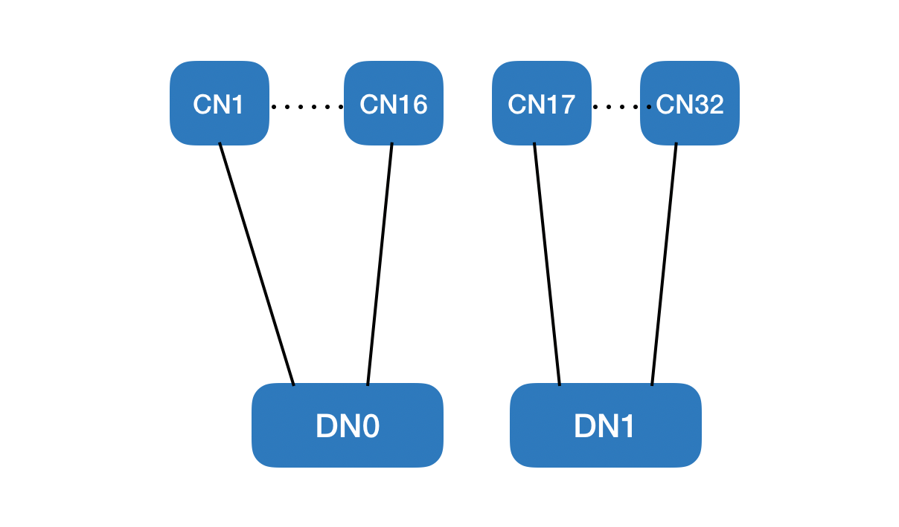

# Coordinated Scheduling Tests

## All Tests

### `PUMA_RF_CS-1`
Description: 2 DNs (DN0 & DN1) co-located on a pole talking to 'x' number of
CNs. CN16 and CN17 have potential interference coupling between them and hence
should be TDD scheduled to avoid interference.

  

Note: Number of CNs can be scaled down as per availability.

Procedure:
* Associate DN0 ↔ CN1 to CN15, associate DN1 ↔ CN18 to CN32
* Set `controlSuperframe` to 0 on DN0 and associate DN0 ↔ CN16
* Set `controlSuperframe` to 1 on DN1 and associate DN1 ↔ CN17
* Verify association success with pings
* Send nominal traffic from both DNs to its respective CNs

Passing:
* All associations should succeed
* All pings should succeed
* Links DN0 ↔ CN16 & DN1 ↔ CN17 should receive half of the total transmitted BW
  for that link
