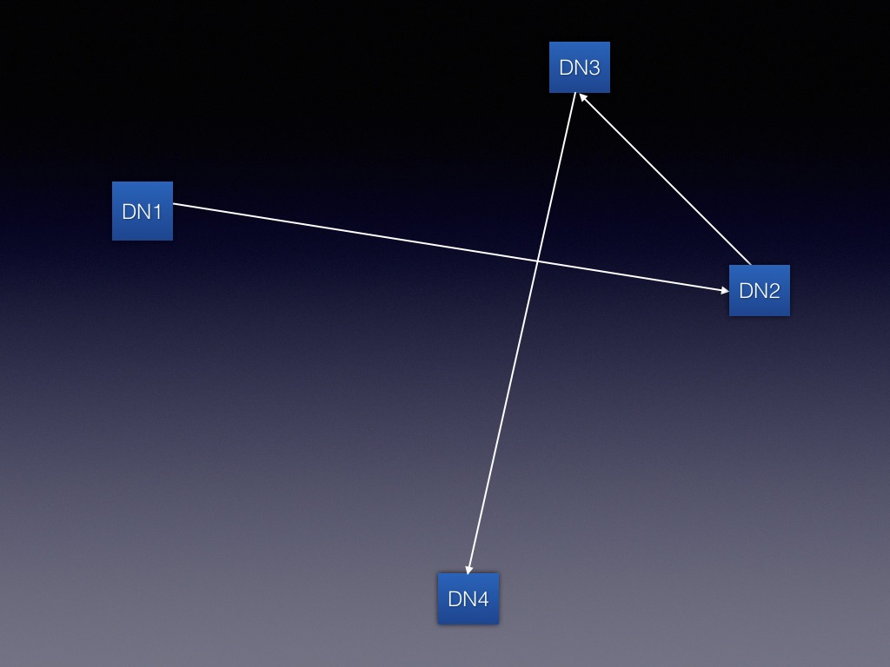
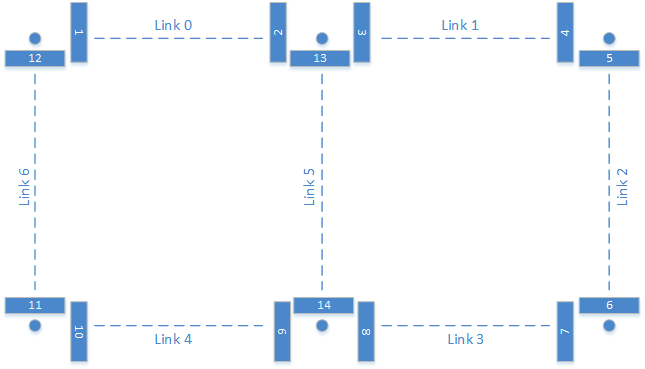
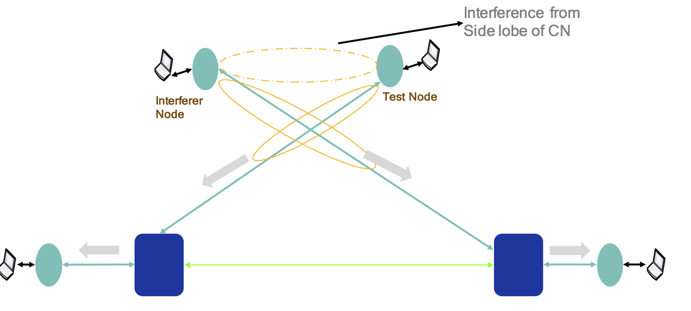

# Interference Tests

## All Tests

### `PUMA_RF_LA-5.0` Impact of flashlight interference on LA
Description: The purpose of this test is to assess the sensitivity of the LA
algorithm to flashlight interference, across a variety of INRs and duty cycles
for interference. To create a carefully controlled interference environment, we
make use of the IF mini-interference testbed.

**Table 4:**

| INR (dB) | SINR | Duty cycle (% of time traffic is running) |
|----------|------|-------------------------------------------|
| -5       | 20   | (10, 20, 40, 50, 60)                      |
| -3       | 20   | (10, 20, 40, 50, 60)                      |
| -1       | 20   | (10, 20, 40, 50, 60)                      |
| 1        | 19   | (10, 20, 40, 50, 60)                      |
| 3        | 17   | (10, 20, 40, 50, 60)                      |
| 5        | 15   | (10, 20, 40, 50, 60)                      |
| 7        | 13   | (10, 20, 40, 50, 60)                      |
| 9        | 11   | (10, 20, 40, 50, 60)                      |
| 11       | 9    | (10, 20, 40, 50, 60)                      |
| 13       | 7    | (10, 20, 40, 50, 60)                      |
| 15       | 5    | (10, 20, 40, 50, 60)                      |
| 17       | 3    | (10, 20, 40, 50, 60)                      |

Test Setup: Dual stack coffin
* DN → CN is Victim Link and IND → INC is Aggressor link.

Procedure:
* Reboot TGs, DNs, and CNs.
* On DN, CN, IND, and INC update `/etc/e2e_config/fw_cfg.json` to reflect the
  following:
    * Disable TPC.
* Init and Config FW on DNs and CNs.
* Associate link IND and INC.
* Program attenuator on the IND → INC path to ensure STF SNR of link is no more
  than -5 dB.
* Disassociate IND and INC.
* Assign Golay code 1 to DN.
* Assign Golay code 2 to IND and INC.
* Associate link DN and CN.
* Ping DN → CN and CN → DN to validate connectivity.
* Program attenuator on the DN → CN path to ensure STF SNR of link is no more
  than 20 dB.
* Associate link IND and INC.
* Ping IND → INC and INC → IND to validate connectivity.
* Run iPerf on the DN → CN with the following parameters:
    * 2 Gbps of UDP traffic (bi-directional)
    * Packet size of 1500 bytes
    * Running time: 5 minutes
* Run iPerf with duty cycle picked from (10,20,40,50,60) in turn on the link IND
  → INC with the following parameters:
    * Packet size of 500 bytes, 1500 bytes and IMIX
    * Running time: 5 minutes Total
* Reduce attenuation on IND → INC path by 2dB and repeat earlier step.
* Continue above two steps for 12 iterations, i.e. for all values shown in
  Table 4 above.

Pass/Fail Criterion:
* Short term PER for all combinations of {INR, Duty-cycle} on the link is < 1% +
  2xTarget_PER for LA.

### `PUMA_RF_LA-5.1` UDP Throughput with fixed MCS+POWER settings VS TPC+LA enabled
Description: The purpose of this test to ensure that LA's performance is at
least as good as Fixed MCS, given the link SNR yields < 0.1% PER for that MCS.

Test Setup: Dual stack coffin, 325m RF link, 200m Link

Procedure:
* Program attenuator with 0 dB attenuation (LA-TB-1 only).
* Reboot the TGs, the DN and the CN.
* For each MCSx in the set {9, 10, 11, 12}, repeat the following tests:
* On both the DN and CN, update `/etc/e2e_config/fw_cfg.json` to reflect the
  following:
    * Fix the MCS to MCSx.
    * Disable TPC.
* Associate both DN and CN.
* Program the attenuator to ensure that STF SNR is at least 2dB above the min
  SNR for MCSx (LA-TB-1 only).
* Ping DN → CN and CN → DN to validate connectivity.
* Run iPerf (on the TG) for 10 mins with the following parameters:
    * 2 Gbps of UDP traffic (bi-directional)
    * Packet size of 1500 bytes
* Record the throughput on the link in each direction.
* On both the DN and CN, update `/etc/e2e_config/fw_cfg.json` to reflect the
  following:
    * Enable link adaptation on the link with Max MCS = MCSx picked in the
      earlier step.
    * Enable TPC.
* Associate both DN and CN.
* Ping DN → CN and CN → DN to validate connectivity.
* Run iPerf (on the TG) for 10 mins with the following parameters:
    * 2 Gbps of UDP traffic (bi-directional)
    * Packet size of 500 bytes, 1500 bytes and IMIX
* Record the throughput on the link in each direction.

Pass Criterion:
* The mean UDP throughput with Link Adaptation is within 95% of Fixed MCS
  performance.
* Long term PER < Target PER throughout the run.
* Short term PER < 1%+Target PER throughout the run.

### `PUMA_RF_LA-5.2` Adjacent point-to-point links with early weak interference
Description: The purpose of this test is to assess how well Max AGC tracking,
CRS, and Golay Code handle early weak interference. Where Golay code assignment
is enabled, assign Golay Code {1,1} to one link and Code {2,2} to the other
link. Where Golay code assignment is disabled, assign Golay Code {1,1} to both
links.

Note that CRS disabled implies a CRS value of 16 in the configuration, whereas
max AGC disabled means AGC is left free-running (see preparation section above).

**Table 5:**

| Case | Golay    | Max AGC  | CRS      |
|------|----------|----------|----------|
| 1    | Enabled  | Enabled  | Disabled |
| 2    | Enabled  | Disabled | Enabled  |
| 3    | Disabled | Enabled  | Enabled  |
| 4    | Enabled  | Enabled  | Enabled  |

Test Setup: Alpha Turn setup
* Links 10-5 (DN1 & DN2), and (CN1 & CN2) 11-9 & 11-8.
* CN1 → DN1 is Aggressor and CN2 → DN2 is Victim link.

Procedure:
* Reboot TGs, DNs, and CNs.
* On both the DNs and CNs, update `/etc/e2e_config/fw_cfg.json` to reflect the
  combinations shown in table 4 above.
* Init and Config FW on DNs and CNs.
* Associate link DN2 and CN1 and record Tx beam of CN1 to DN2, by parsing the
  value of the following field in fw_stats:
    * phyPeriodic.txBeamIdx
* Disassociate DN2 and CN1.
* Add +1 microsecond to the transmit time of slots for nodes DN2 and CN2 in the
  `fw_cfg.json` file, as shown below:
    *  "txSlot0End": 87,
    *  "txSlot0Start": 7,
    *  "txSlot1End": 182,
    *  "txSlot1Start": 97,
    *  "txSlot2End": 197,
    *  "txSlot2Start": 192,
* Associate link DN2 and CN2.
* Ping DN2 → CN2 and CN2 → DN2 to validate connectivity.
* Associate link DN1 and CN1 with the CN configured to use the Tx beam recorded
  in the earlier step, as follows in `fw_cfg.json` file:
    * beamConfig: 0
    * txBeamIndex: `<TxBeam>`
    * rxBeamIndex: 0
* Ping DN1 → CN1 and CN1 → DN1 to validate connectivity.
* Run iPerf (on the TG) on the links CN1 → DN1 and CN2 → DN2 with the following
  parameters:
    * 2 Gbps of UDP traffic (bi-directional)
    * Packet size of 1500 bytes
    * Running time: 5 minutes
* Record the throughput on link CN2 → DN2.
* Repeat the procedure for each case shown in Table 5.
* Disassociate DN2 → CN2 and DN1 → CN1.
* On both the DNs and CNs, update `/etc/e2e_config/fw_cfg.json` to reflect the
  combinations shown in Table 5 above.
* Associate link DN2 and CN2.
* Ping DN2 → CN2 and CN2 → DN2 to validate connectivity.
* Associate link DN1 and CN1 with the CN configured to use the Tx beam recorded
  in the earlier step.
* Ping DN1 → CN1 and CN1 → DN1 to validate connectivity.
* Run iPerf (on the TG) on the links CN1 → DN1 and CN2 → DN2 with the following
  parameters:
    * 2 Gbps of UDP traffic (bi-directional)
    * Packet size of 1500 bytes
    * Running time: 5 minutes
* Record the throughput on link CN2 → DN2.

Pass/Fail Criterion:
* Full UDP throughput of 1Gbps is achieved on link CN2 → DN2 with all the cases
  listed in Table 5.
* LA is able to maintain MCS 9 on CN2 → DN2 for all the cases listed in Table 5.

### `PUMA_RF_LA-5.3` MPK alpha turn with the early weak interference
Description: The purpose of this test is to assess how well Max AGC tracking,
CRS Threshold, and Golay codes handle early weak interference. This Alpha turn
setup exercises the specific case of a near-far links where the long link
transmits at high power and causes interference to the shorter link  on the same
pole.

Test Setup: Alpha Turn Setup (see below)

  

Procedure:
* Reboot TGs, DNs, and CNs.
* Init and Config FW on DNs and CNs.
* Bring up the Alpha turn topology using.
* Ping all links to validate connectivity.
* Sample the STF SNR (for ~30 seconds) on each link and verify it is at least 14
  dB.
* Run iPerf on each link from link-local to link-local using the following
  parameters:
    * 2 Gbps of UDP traffic (bi-directional)
    * Packet size of 1500 bytes
    * Running Time: 3 minutes
* Run iPerf UDP uni-directionally from DN1 → DN4 using the following parameters:
    * 2 Gbps
    * Packet size of 5784 bytes
    * Running Time: 3 minutes
* Run iPerf UDP uni-directionally from DN4 → DN1 using the following parameters:
    * 2 Gbps
    * Packet size of 1500 bytes
    * Running Time: 3 minutes
* Run iPerf UDP bi-directionally between DN1 → DN4 using the following
  parameters:
    * 2 Gbps
    * Packet size of 1500 bytes
    * Running Time: 3 minutes

Pass/Fail Criterion:
* Each UDP session in the test achieves full 1Gbps throughput.
* Long term PER < Target PER throughout the run.
* Short term PER < 1%+Target PER throughout the run.
* LA is able to maintain MCS 9 on each link throughout the test.

### `PUMA_RF_LA-5.4` DN ZIG-ZAG links with nominal 3 hop interference
Description: The purpose of this test is to assess how well TPC and LA adapt to
interference from a neighboring high power link that is 3 hops from the victim
link.

| Test ID  | Link 1 Golay | Link 2 Golay | Link 3 Golay |
|----------|--------------|--------------|--------------|
| LA-5.4.1 | {1,1}        | {1,1}        | {1,1}        |
| LA-5.4.2 | {1,1}        | {1,1}        | {2,2}        |

Test Setup: Zig-Zag Setup

Procedure:
* Reboot TGs, DNs, and CNs.
* Init and Config FW on DNs and CNs.
* Configure DN1 to disable TPC, i.e. have it run at full power (=28).
* Configure DNs and CNs to have Golay based on the table above.
* Associate DN2 → CN2, using `r2d2`.
* Sample STF SNR on the link and record Tx Power on DN2.
* Associate DN1 → CN1, using `r2d2`.
* Sample STF SNR on the link and record Tx Power on DN2
* Ping DN1 → CN1 and CN1 → DN1 to validate connectivity.
* Ping DN2 → CN2 and CN2 → DN2 to validate connectivity.
* Run uni-directional UDP iPerf from DN1 → CN1 and DN2 → CN2 with the following
  parameters:
    * 2 Gbps
    * Packet size of 1500 bytes
    * Running time = 5 minutes.
* Sample STF SNR on the link and record Tx Power on DN2 when iPerf is running in
  the earlier step.
* Run bi-directional UDP iPerf from DN1 → CN1 and DN2 → CN2 with the following
  parameters:
    * 2 Gbps
    * Packet size of 1500 bytes
    * Running time = 5 minutes.

Pass/Fail Criterion:
* Each UDP session in the test achieves full 1Gbps throughput.
* LA is able to maintain MCS 9 on both the links.
* TPC increases Tx Power on DN2 → CN2 to compensate for interference from DN1 →
  CN1.

### `PUMA_RF_LA-5.6` Butterfly interference with acute angle CNs
Description: The purpose of this test is to assess how well TPC and LA are able
to handle interference between associated DNs, when they are communicating with
their respective CNs, i.e. DN → CN, CN → DN. This is achieved by means of a
setup crafted with different acute angles between DN-DN and DN-CN links.

Test Setup: Butterfly setup

Procedure:
* Reboot TGs, DNs, and CNs.
* Init and Config FW on DNs and CNs.
* Associate DN1 → DN2, using `r2d2`.
* Ping DN1 →DN2 and DN2 → DN1 to validate connectivity.
* Associate DN1 → CN1, using `r2d2`.
* Ping DN1 → CN1 and CN1 → DN1 to validate connectivity.
* Sample STF SNR on the link and record Tx Power on DN2.
* Associate DN2 → CN2, using `r2d2`.
* Ping DN2 → CN2 and CN2 → DN2 to validate connectivity.
* Sample STF SNR on the link and record Tx Power on DN1.
* Run uni-directional UDP iPerf from CN1→ CN2 and CN2 → CN1 with the following
  parameters:
    * 2 Gbps
    * Packet size of 1500 bytes
    * Running time = 5 minutes.

Pass/Fail Criterion:
* Each UDP session in the test achieves full 1Gbps throughput.
* LA is able to maintain MCS 9 on both the links.
* Long term PER < Target PER throughout the run.
* Short term PER < 1%+Target PER throughout the run.
* TPC increases Tx Power to compensate for strong interference between links.

### `PUMA_RF_LA-5.7` Figure of 8 interference scenarios
Description: The purpose of this test is to assess how well TPC, LA, and AGC
work to mitigate interference in a Figure of 8 test setup. We create a few
interference-limited topologies to evaluate performance by igniting only a
subset of the links to create the U turn, the S turn, and the H configuration.
Details are given below. Note, the following the assignment of Golays to each
link for all tests:

* Golay 1: Links 0, 1, 3, and 4.
* Golay 2: Links 2, 5 and 6.

This test should also be repeated with the following Golay code assignments:

* Golay 1: Links 0 and 1
* Golay 2: Links 2 and 6
* Golay 3: Links 3 and 4
* Golay 4: Link 5

  

U-Turn:
* Remove links 5 and 6 (U_1).
* Remove links 2 and 5 (U_2).

H-Turn:
* Remove links 2 and 6.

S-Turn:
* Remove links 1 and 4 (S_1).
* Remove links 0 and 3 (S_2).

**Table 3:**

| Source | Sink | Uni-Directional (each way) | Bi-Directional | Topology Type |
|--------|------|----------------------------|----------------|---------------|
| 11     | 12   | Yes                        | Yes            | U_1           |
| 5      | 6    | Yes                        | Yes            | U_2           |
| 6      | 12   | Yes                        | Yes            | H             |
| 5      | 11   | Yes                        | Yes            | H             |
| 4      | 10   | Yes                        | Yes            | S_1           |
| 1      | 7    | Yes                        | Yes            | S_2           |

Test Setup: RF Fig of 8

Procedure:
* Reboot TGs, DNs, and CNs.
* Init and Config FW on DNs and CNs.
* Ignite all links using `r2d2` or E2E controller. For `r2d2`, pay close
  attention to which nodes are initiator and responder, because this affects how
  the polarity is configured on the link. By default, the initiator has EVEN
  polarity.
* Ping each wireless hop (using lo interface) and ensure connectivity in each
  direction.
* Run UDP iPerf from source → sink as shown in Table 3 above with the following
  parameters and record throughput:
    * 2 Gbps
    * Packet size of 1500 bytes
    * Running time = 5 minutes.
* Run TCP iPerf from source → sink as shown in Table 3 above with the following
  parameters and record throughput:
    * 2 Gbps
    * Packet size of 1500 bytes
    * Running time = 5 minutes.

Pass/Fail Criterion:
* Each UDP session in the test achieves at least 1Gbps throughput.
* Each TCP session in the test achieves at least 1Gbps throughput.
* LA is able to maintain MCS 9 on both the links.
* Long term PER < Target PER throughout the run.
* Short term PER < 1%+Target PER throughout the run.

### `PUMA_RF_LA-5.8` CN-To-CN interference
Description: This test creates a scenario whereby neighboring CNs 100m apart
cause side-lobe interference to one another. It's intended to evaluate whether
AGC and CRS features mitigate the impact of interference under these conditions.

Test Setup: CN-TO-CN interference setup (see below)

  

Procedure:
* Reboot TGs, DNs, and CNs.
* Init and Config FW on DNs and CNs.
* Associate DN1 → DN2, using `r2d2`.
* Ping DN1 →DN2 and DN2 → DN1 to validate connectivity.
* Associate DN1 → CN1, using `r2d2`.
* Ping DN1 → CN1 and CN1 → DN1 to validate connectivity.
* Associate DN2 → CN2, using `r2d2`.
* Ping DN2 → CN2 and CN2 → DN2 to validate connectivity.
* Run uni-directional UDP iPerf on CN1→ DN1 and DN2 → CN2 with the following
  parameters:
    * 2 Gbps
    * Packet size of 1500 bytes
    * Running time = 5 minutes.
* Record the throughput from DN2 → CN2.
* Run uni-directional UDP iPerf on CN2→ DN2 and DN1 → CN1 with the following
  parameters:
    * 2 Gbps
    * Packet size of 1500 bytes
    * Running time = 5 minutes.
* Record the throughput from DN1 → CN1.

Pass/Fail Criterion:
* Each recorded UDP session in the test achieves full 1Gbps throughput.
* LA is able to maintain MCS 9 on both the links.
* Long term PER < Target PER throughout the run.
* Short term PER < 1%+Target PER throughout the run.
