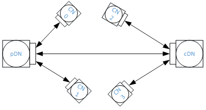

# Link Level Scheduler Tests
In this test scenario, DN is serving four CNs. We will test the basic
association, and scheduling performance in different test cases.

## All Tests

### `PUMA_RF_LLS-1.1` Basic association and throughput
Setting: T_ideal = 0.25 and MCS=9 for all CNs

Procedure:
* Start association from CN0 to CN3 and run the ping and iPerf after the
  associations are done:
    * Check association is finished successfully.
    * Start ping for 60 seconds, write down the ping stats. Ping latency should
      be around 1.6ms*number of CNs associated.
    * Start iPerf UDP/TCP for 300 seconds (through a traffic generator), for MCS
      9, the throughput should be close to 850Mbps for unidirectional traffic
      and 910Mbps for bidirectional traffic.
* Run unidirectional iPerf UDP/TCP on TGs from DN to CN0 and CN1 with rate 1Gbps
  and 200Mbps respectively. The rate achieved on TGs for CN0 and CN1 should be
  close to 650Mbps and 200Mbps, respectively. Do the same to measure UL
  performance from CN0 and CN1 to DN, and then bidirectional performance.
* Run unidirectional iPerf UDP/TCP on TGs from DN to CN0, CN1 and CN2 with rate
  1Gbps, 100Mbps and 200Mbps respectively. The rate achieved on TGs for CN0, CN1
  and CN2 should be close to 550Mbps, 100Mbps and 200Mbps, respectively. Do the
  same to measure UL performance from CN0, CN1 and CN2 to DN, and then
  bidirectional performance.
* Run unidirectional iPerf UDP/TCP on TGs from DN to CN0, CN1, CN2 and CN3 with
  rate 300Mbps, respectively. The rate achieved on TGs for CN0, CN1, CN2 and CN3
  should be > 200Mbps (ideally close to 907/4=226), respectively. Do the same to
  measure UL performance from CN0, CN1 and CN2 to DN, and then bidirectional
  performance.
* Run unidirectional iPerf UDP/TCP on TGs from DN to CN0, CN1, CN2 and CN3 with
  rate 1Gbps, 100Mbps, 150Mbps and 200Mbps respectively. The rate achieved on
  TGs for CN0, CN1, CN2 and CN3 should be at least 350Mbps (457M =
  907-100-150-200 if ideal), 100Mbps, 150Mbps and 200Mbps, respectively. Do the
  same to measure UL performance from CN0, CN1, CN2 and CN3 to DN, and then
  bidirectional performance.
* Run unidirectional iPerf UDP/TCP on TGs from DN to CN0, CN1, CN2 and CN3 with
  rate 1Gbps on each link with on and off pattern below (basically two ONs and
  one OFF in between). Note that the start time for different CNs are different.
  The rate achieved on TGs for CN0, CN1, CN2 and CN3 should be close to 200Mbps
  each. Do the same to measure UL performance from CN0, CN1, CN2 and CN3 to DN,
  and then bidirectional performance.

For TCP if using `iperf`, use `-w` to control the rate; if `iperf3`, use `-b` to
control the rate similar to UDP case.

### `PUMA_RF_LLS-1.2` Basic association during traffic
In this test, we will check Basic association procedure during traffic.

Setting: T_ideal = 0.25 and MCS=9 for all CNs

Procedure:
* Start association to CN0
    * Check association is finished successfully.
    * Start ping for 60 seconds, write down the ping stats. Ping latency should
      be around 0.4ms.
    * At time t0=0, start iPerf UDP/TCP, for MCS 9, the throughput should be
      close to 1000Mbps for unidirectional/bidirectional.
* Keep the traffic to CN0 running, and start association to the CN1:
    * Check association is finished successfully. Note that there will be
      throughput dip (about 1/2 drop) for CN0 during the association, that is
      expected due to the BF procedure wipes out 2/3 of the channel capacity
      now.
    * Start ping for 60 seconds, write down the ping stats. Ping latency should
      be equal to the scheduling latency for the control slots for CN1, ~12ms.
    * At time t1, start iPerf UDP/TCP, and observe that CN0 and CN1 split the
      capacity equally, i.e. around 500mbps for both DL and UL.
* Keep the traffic to CN0/CN1 running, and start association to the CN2:
    * Check association is finished successfully.
    * Start ping for 60 seconds, write down the ping stats. Ping latency should
      be equal to the scheduling latency for the control slots for CN2.
    * At time t2, start iPerf UDP/TCP, and observe that CN0, CN1 and CN2 split
      the capacity equally, i.e. around 1Gbps/3 for both DL and UL
* Keep the traffic to CN0, CN1 and CN2 running, and start association to the
  CN3:
    * Check association is finished successfully.
    * Start ping for 60 seconds, write down the ping stats. Ping latency should
      be equal to the scheduling latency for the control slots for CN3.
    * At time t3, start iPerf UDP/TCP, and observe that CN0, CN1, CN2 and CN3
      split the capacity equally, i.e. around 250Mbps for both DL and UL.

Passing:
* CN0's throughput should be around
  $(980*t_1+460*(t_2-t_1)+300*(t_3-t_2)+220*(T_0-t_3))/T_0$, where $T_0$ is the
  total duration of CN0's iPerf traffic.
* CN1's throughput should be around
  $(460*(t_2-t_1)+300*(t_3-t_2)+220*(T_1-t_3))/T_1$, where $T_1$ is the total
  duration of CN1's iPerf traffic.
* CN2's throughput should be around $(300*(t_3-t2)+220*(T_2-t_3))/T_2$, where
  $T_2$ is the total duration of CN2's iPerf traffic.
* CN3's throughput should be around 220.

### `PUMA_RF_LLS-1.3` Traffic scheduling with variable T_ideal
In this test case, we change T_ideal to see if the throughput is distributed
based on the new T_ideal.

Setting: T_ideal = 0.25 and MCS=9 for all CNs initially

Procedure:
* Start association to CN0, CN1, CN2 and CN3
    * Check associations are finished successfully.
    * Start iPerf UDP/TCP, for MCS 9, check every link gets 1/4th of the
      capacity.
* Change T_ideal to the following values {0.5, 0.2, 0.2, 0.1}
    * Check if the throughput of those iPerf sessions have been redistributed
      based on the above setting (there may be some throughput difference due to
      the packet packing. But the throughput should be proportional to that
      T_ideal number.
* Change T_ideal to the following values {0.7, 0.1, 0.1, 0.1}
    * Check if the throughput of those iPerf sessions have been redistributed
      based on the above setting.

### `PUMA_RF_LLS-1.4` Traffic scheduling with variable MCS
In this test case, we change MCS and see if the scheduling is allocated fairly
to its T_ideal.

Setting: T_ideal = 0.25 for all CNs initially

Procedure:
* Start association to CN0, CN1, CN2 and CN3
    * Check associations are finished successfully.
    * Start iPerf UDP/TCP, for MCS 9, check every link gets 1/4th of the
      capacity.
* Change MCS of CN0, CN1, CN2 and CN3 to {10, 9, 8, 7} (if we cannot change the
  MCS on the fly, then just use static setting and reassociate as in Step 1.)
    * Check if the throughput of those iPerf sessions are proportional to
      MCS10:MCS9:MCS8:MCS7 = 3080:2502.5:2310:1925.

### `PUMA_RF_LLS-1.6` Basic disassociation
Setting: T_ideal = 0.25 for all CNs. All CNs are associated. Bidirectional iPerf
are running through all CNs.

Procedure:
* Start disassociation to CN0
    * Check disassociation is finished successfully.
    * Verify that the throughput of each remaining CN is at least 300Mbps.
* Start disassociation to CN1
    * Check disassociation is finished successfully.
    * Verify that the throughput of each remaining CN is at least 500Mbps.
* Start disassociation to CN2
    * Check disassociation is finished successfully.
    * Verify that the throughput of CN3 is at least 1000Mbps.

### `PUMA_RF_LLS-2` Butterfly Network
In this scenario, we consider a butterfly network where cDN has CNs to serve as
well. The topology is shown below:

  

### `PUMA_RF_LLS-3.1` Basic association
Setting: MCS=9 for all DNs and CNs, T_ideal for pDN-cDN is 0.5, while T_ideal =
0.2 for all CNs both DL and UL.

Procedure:
* Start association from cDN, and then trigger association to CN0, CN1, CN2 and
  CN3 sequentially
    * Check associations are finished successfully.
    * Start ping from pDN to CN0, CN1, CN2 and CN3, and verify that the ping
      latency is less than 4.8ms.
    * Start iPerf UDP/TCP from pDN to CN0 and CN1 for both unidirectional and
      bidirectional, and check if the throughput is close to 400/450Mbps.
    * Stop traffic, and start iPerf UDP/TCP from pDN to CN2 and CN3 for both
      unidirectional and bidirectional, check if the throughput is at least
      425/200Mbps.

### `PUMA_RF_LLS-3.2` Speed Test - CN to CN traffic
Setting: laMaxMcs=9 for all DNs and CNs, T_ideal for pDN-cDN is 0.5, while
T_ideal = 0.2 for all CNs both DL and UL.

Test Setup: Butterfly test setup

Procedure:
* Start iPerf UDP/TCP from CN0 to CN2
    * Check if throughput is at least 850Mbps.
* Keep the traffic from CN0 to CN2 running, and start a new iPerf UDP/TCP from
  CN1 to CN3
    * Check if the throughput for both iPerf sessions are at least 425Mbps.
* Stop the traffic from CN0 to cCN2, and observe the throughput from CN1 to CN3
  increases to 850Mbps.
* Start new iPerf UDP/TCP from CN2 to CN0
    * Check if both iPerf sessions have throughput at least 333Mbps.

### `PUMA_RF_LLS-3.3` Speed Test - DN to DN backhaul traffic
Setting: MCS=9 for all DNs and CNs, T_ideal for pDN-cDN is 0.7, while T_ideal =
0.1 for all CNs both DL and UL.

Procedure:
* Start iPerf UDP/TCP from CN0 to CN2
    * Check if throughput is at least 850Mbps.
* Keep the traffic from CN0 to CN2 running, and start a new iPerf UDP/TCP from
  pDN to cDN
    * Check if the throughput from pDN to cDN is at least 425Mbps.
    * Check if the throughput from CN0 to CN2 is at least 400Mbps.
* Stop the traffic from CN0 to CN2, and observe the throughput from pDN to cDN
  increases to 900Mbps.
* Start new iPerf UDP/TCP from CN2 to CN0
    * Check if the throughput from pDN to cDN is at least 700Mbps.
    * Check if the throughput from CN2 to CN0 is at least 100Mbps.
