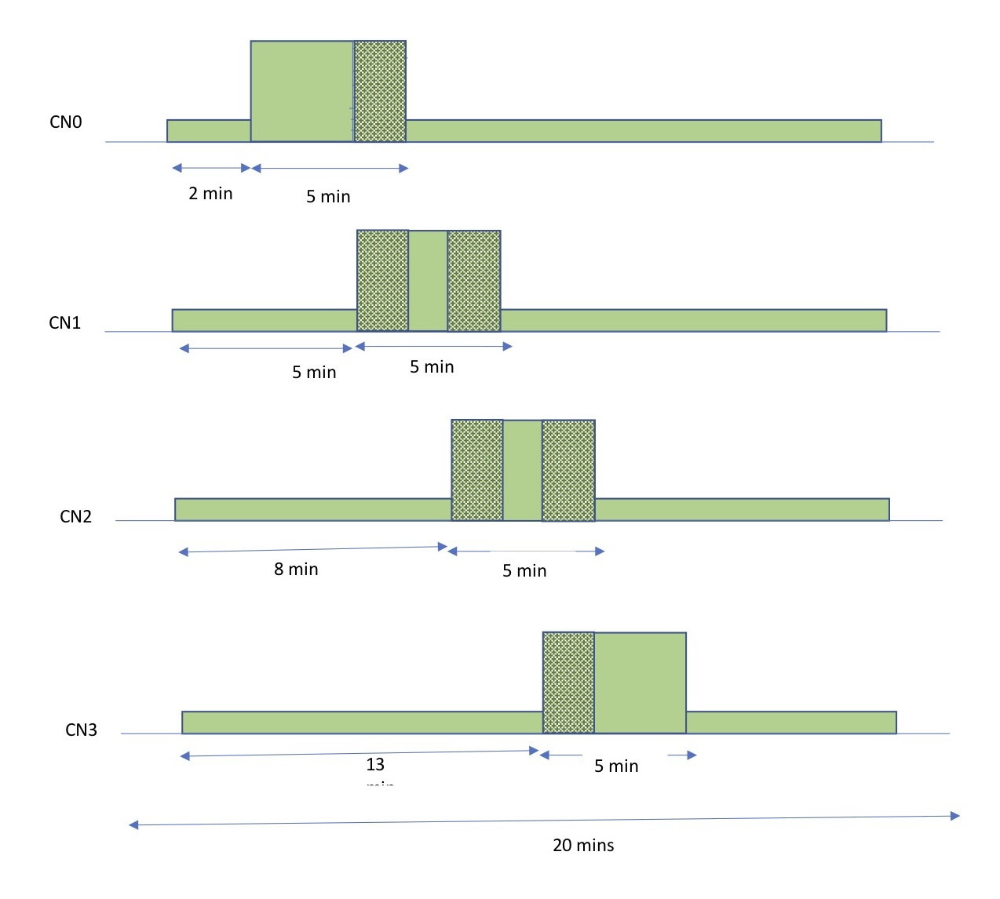

# Link Overloading Tests

## All Tests

### `PUMA_RF_LOT1` 1DN:4CN/8CN Link Overload Tests
Description: P2MP Link Overloading test (DN to 4-CN/8-CN).

Setup: P2MP Setup

Procedure:
1. Bring up the P2MP setup using E2E.
2. Start iPerf UDP on all links (DN → 4CNs/8CNs) for 600 seconds, with packet size
   of 1500 and data rate of 100Mbps.
3. In parallel to step 2 (after 5 minutes delay), start iPerf UDP on DN → CN0
   link for 300 seconds, with packet size of 1500 and data rate of 1G (DN to
   4CNs setup) and data rate of 500 Mbps (for DN to 8CN setup).

Passing:
1. All nodes/links in the topology must come up after step 1.
2. Links must stay up all the time.
3. 125Mbps on all links but CN0 and 200Mbps on CN0 link

### `PUMA_RF_LOT2` 1DN:4CN/8CN Link Overload Tests - Multi sector
Description: P2MP Link Overloading test (DN to 4-CN/8-CN).

Setup: P2MP Setup

Procedure:
1. Bring up the P2MP setup using E2E.
2. Start iPerf UDP on all links for 600 seconds, for MCS 9, with packet size of
   1500 and data rate of 100Mbps.
3. In parallel to step 2 (after 5 minutes delay), start iPerf UDP on all links
   for 300 seconds, with packet size of 1500 and data rate of 300Mbps.

Passing:
1. All nodes/links in the topology must come up after step 1.
2. Links must stay up all the time.

### `PUMA_RF_LOT3` 1DN:4CN/8CN Link Overload Tests - Burst Mode
Description: P2MP Link Overloading test in Burst Mode (DN to 4-CN/8-CN).

Setup: P2MP Setup

Procedure:
1. Bring up the P2MP setup using E2E.
2. Start iPerf UDP on all links for 1200 seconds, with packet size of 1500 and
   data rate of 100Mbps.
3. In parallel to step 2:
    1. (after 2 minutes delay) run unidirectional iPerf UDP from links (DN →
       CN1), for 300 seconds, with rate 1Gbps. Note that the start time for
       different CNs are different.
    2. With delay of 3 minutes to previous iPerf, run unidirectional iPerf UDP
       from links (DN → CN2), for 300 seconds, with rate 1Gbps.
    3. Repeat step 3b for remaining CNs sequentially.

Passing:
1. All nodes/links in the topology must come up after step 1.
2. Links must stay up all the time.
3. Since it is a bidirectional test, in each direction the link should be
   getting more than 100Mbps throughput.

  

