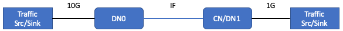
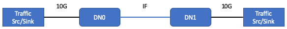
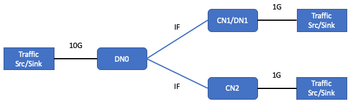
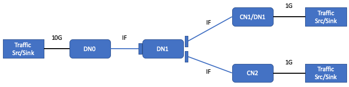
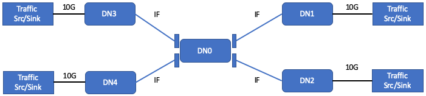

# QoS Tests

## Introduction
Consistent with the QoS requirements partially specified by the Puma PRD and by
our data path design, a Terragraph DN must support the following:
1. Uplink traffic policing performed separately for each of 4 Traffic Classes:
    1. Traffic marked to be within committed rate (CIR)
    2. Traffic marked to be in excess of committed rate (EIR) but below peak
       rate
    3. Traffic above peak rate shall be dropped
    4. CIR and EIR can be configured with different values for different Traffic
       Classes
2. Downlink traffic policing is expected to be done external to the Terragraph
   network.
3. After policing, the Traffic Class and Drop Preference are indicated by the
   IPv6 header DSCP value. The mapping from Traffic Class and Drop Preference to
   DSCP value is configurable and identical for downlink and uplink traffic.
4. [Not specified in PRD but consistent with the implementation] At each TG
   sector, the 4 Traffic Classes are served according to a strict priority
   policy — in this document, TC0 is the highest priority and TC3 is the lowest
   priority.
5. [Not specified clearly] Uplink traffic policing is required for ingress on
   the 1G interface for both DN and CN operation. It is not required to support
   uplink traffic policing for ingress on the DN 10G interface. It is not yet
   determined whether the implementation will support policing on the 10G
   interface; this test plan is defined assuming not.
6. [Not specific to QoS] According to the finalized Puma HW design, it is
   expected that a single Puma DN can simultaneously sustain MCS 12 data rates
   on 2 specific sectors and MCS 11 data rates on the 2 other specific sectors.
   Additionally and specifically, the system will constrain the two relevant
   sectors to a maximum of MCS 11 at all times.

The point of this test plan is to confirm the proper functionality of the QoS
functions, which requires more elaborate traffic scenarios than many other types
of validation tests. Many of the pass/fail criteria in this document include "~X
Mbps" to indicate "about X Mbps," based on what we should expect. The criteria
here are intentionally not specified to precisely account for various protocol
and control traffic overheads -- that is not the intention for these acceptance
tests.

Note: All of the test setups in this document assume IF connections between TG
sectors. If only RF connections are possible, it is fine to use RF connections
instead provided they can reliably support the expected PHY rates for each test
(MCS 9, MCS 12, or as specified in the test).

## Data Plane Operation and Traffic Models
Validation tests are based on two traffic models: IMIX and fixed rate traffic.

### User Plane Traffic
User plane data traffic is generated using the following traffic models.

#### Traffic with Fixed Packet Size
In this traffic model, packet size will be fixed at 128 bytes or greater, up to
1500 bytes. Any fixed packet size between 128 and 1500 bytes, inclusive, is
allowed. Packet interarrivals may be constant or exponential (i.e. Poisson
arrivals). In both cases the arrival rate will be chosen to give the desired
data rate in Gbps or Mbps. Note: iPerf may be used to generate this traffic with
a fixed arrival rate.

#### IMIX Traffic Models
The following table contains the distribution of IMIX data used for acceptance:

| Packet Size in Bytes (incl. IP Header) | Distribution (in packets) |
|----------------------------------------|---------------------------|
| 40                                     | 58.3333%                  |
| 576                                    | 33.3333%                  |
| 1500                                   | 8.3333%                   |

With an average packet size of 340 bytes, the packet rate for IMIX traffic to
achieve 2 Gbps, for example, is approximately ~735Kpps.

#### IMIX Generation Model 1
A hardware generator such as Ixia can be used to generate packets with a Poisson
arrival rate. The size of every arriving packet is random and is either 40, 576,
or 1500 bytes with the size given by the probability distribution in the table
above. The arrival rate is chosen to give the desire data rate in Gbps or Mbps.

#### IMIX Generation Model 2
In this model we mix 3 streams of constant size packets (given in the table
above). The ratios of the data rates for each stream is chosen to obtain the
IMIX distribution. The absolute rate of each stream is chosen to give the
overall desired rate. For example, to achieve a rate of approximately 2.5 Gbps,
we can generate three data flows with the following settings:

1. For flow 1, generate packets at rate 535.6 KPPS with packet size 40 bytes
2. For flow 2, generate packets at rate 306.1 KPPS with packet size 576 bytes
3. For flow 3, generate packets at rate 76.5 KPPS with packet size 1500 bytes

Note that the constant packet model does not test any burstiness brought by the
IMIX model.

#### Traffic Class Identification for User Plane Traffic
The requirement is to support strict priority between the Traffic Classes -- we
denote by TC0 the highest priority. With 4 Traffic Classes, TC3 denotes the
lowest priority.

The classes are identified by the DSCP value in the IPv6 header. Additionally,
rate policing is signaled using two different DSCP values for each Traffic
Class, one signifying 'committed' traffic and the other 'excess' traffic (higher
drop preference). The mapping from DSCP to Traffic Class and Drop Preference
must be configurable. For testing, we use the following mapping from Traffic
Class and Drop Preference to DSCP:

| QoS Class, Drop Preference | TC0, Low (Green) | TC0, High (Yellow) | TC1, Low (Green) | TC1, High (Yellow) | TC2, Low (Green) | TC2, High (Yellow) | TC3, Low (Green) | TC3, High (Yellow) |
| --- | --- | --- | --- | --- | --- | --- | --- | --- |
| DSCP Value (Decimal) | 34 | 36 | 26 | 28 | 18 | 20 | 10 | 12 |

Note: Logically this mapping can be arbitrary. This mapping is based on commonly
used DiffServ mappings, with:
* (TC0, Green / Yellow) corresponding to 'AF41' /'AF42'
* (TC1, Green / Yellow) corresponding to 'AF31' / 'AF32'
* (TC2, Green / Yellow) corresponding to 'AF21' / 'AF22'
* (TC3, Green / Yellow) corresponding to 'AF11' / 'AF12'

For traffic beyond a policer, all other DSCP values should be handled
equivalently to TC3, Yellow -- i.e. the lowest priority. Ideally this will never
happen, but the implementation should handle it gracefully.

### Policing

#### 2 rate / 3 color policing
According to QoS requirements, policing is done separately per Traffic Class. By
definition, the policing function is a 2 rate / 3 color policer. Traffic
conforming to the lower rate is considered 'green', corresponding to low drop
preference (last to be dropped from that Traffic Class). Traffic beyond 'green'
and conforming to the higher rate is considered 'yellow', corresponding to
higher drop preference (dropped before 'green' traffic). Traffic beyond 'green'
and 'yellow' is considered 'red' and must not be forwarded to another TG sector.

Traffic inbound to a policing function that has an unknown DSCP value must be
considered equivalent to TC3, Green.

#### Upstream versus downstream policing
Traffic inbound from a user device attached to a TG node is considered upstream
traffic, and this is required only on a 1G interface / port. Traffic inbound to
the TG network from a POP node toward a user device is considered downstream
traffic and is expected on a 10G interface / port.

Upstream traffic must be policed on the TG node to which it is attached.
Policing corresponds to applying the 2 rate / 3 color policing function
configured for that user device and Traffic Class. At ingress to the TG node,
the upstream traffic is expected to be marked with DSCP corresponding to one of
the supported Traffic Classes with low drop preference (Green). Depending on the
inbound rate and corresponding policing function configuration, some traffic
will pass unmodified, some traffic potentially will have DSCP remarked to the
corresponding 'Yellow' color of that Traffic Class, and some traffic potentially
dropped within the node due to exceeding the second configured policing function
rate, i.e. being 'Red'.

Downstream traffic is not policed directly within the TG (DN POP) node. The
policing function is instead applied within the core network edge router (or
before). It is expected to be properly marked by DSCP according to one of the
supported Traffic Classes and Drop Preferences. In this test plan, we assume the
traffic generators do not have internal 2 rate / 3 color policing functionality
but can generate traffic with different specified DSCPs. Therefore, for
downstream traffic of a particular Traffic Class, we generate downstream 'Green'
and 'Yellow' traffic independently and in parallel. This prevents us from easily
testing any downstream scenario with congestion for a Traffic Class carrying TCP
traffic -- the traffic source will not be able to produce a single TCP stream
with a mix of Green and Yellow traffic.

## Testing Defaults (Mostly Configuration)
Unless otherwise specified in a particular test:
1. UDP traffic with fixed size packets of size 512 bytes, and fixed packet
   inter-arrivals determined by the offered traffic throughput (TCP traffic will
   be used heavily for general testing but limited for QoS tests).
    1. There is a known core data plane packet processing limitation of
       approximately 450kPPS for traffic routed from WiGig to WiGig interfaces.
       Until this known PPS limitation is improved, we should apply the
       following:
        1. 1150B payload size (or larger) for multi-hop bidirectional tests
        2. 800B payload size (or larger) for multi-hop unidirectional tests
        3. These should work for multihop tests where TG nodes have at most 2
           sectors handling traffic, and should work for single hop tests with
           yet more headroom.
2. When not using precision test equipment to characterize delay, `iperf3`
   should be used.
3. Upstream policing function for each Traffic Class:
    1. Configured as [RFC 4115](https://tools.ietf.org/html/rfc4115), which
       includes the following configuration parameters:
        1. Green / CIR = 300 Mbps.
        2. Yellow / EIR = 700 Mbps.
        3. CBS = TBD (may have to tune during testing). This parameter is
           'Committed Burst Size', defining the token bucket size (in bytes)
           used for marking CIR traffic.
        4. EBS = TBD (may have to tune during testing). This is 'Excess Burst
           Size', defining the token bucket size (in bytes) used for marking EIR
           traffic.
4. Test traffic run for 180 seconds. When verifying throughputs, ignore the
   first 5 seconds after traffic is started so that we measure the performance
   in steady state, consistent with how we typically test and verify Terragraph
   system performance (specifically, ignore traffic for the same amount of time
   as we typically do for testing, if not 5 seconds).
5. All tests in this test plan fix MCS in order to provide predictable pass/fail
   criteria for the different traffic class streams. Transmit power shall also
   be fixed (appropriate for the physical setup) to avoid introducing PER.
6. Some of these tests are based on MCS = 6. We originally expected this MCS to
   yield approximately 750 Mbps bidirectional throughput for UDP. Based on the
   extra hugging and the changes in throughput from Qualcomm, the expected MCS 6
   rate is 587 Mbps for UDP. To confirm, we measured 602 Mbps in the lab.
   Therefore we modified all tests based on MCS = 6 in this document to assume
   590 Mbps bidirectional throughput for UDP.
7. Average packet delay, average delay jitter, and histogram of packet delay
   should be captured for each separate traffic flow as part of test results, if
   the test equipment permits. We will need to make an engineering judgment call
   whether the results are acceptable.
8. Many tests indicate “verify ~ X Mbps" for a traffic flow. To be precise,
   define the pass / fail criterion as at least 90% of X Mbps.

### VPP policer configuration:

```sh
/usr/bin/tg_vpp_cfg -c /etc/vpp/vpp_config.json -t -i \
  -p policer_add_del_tc0 \
  -p policer_add_del_tc1 \
  -p policer_add_del_tc2 \
  -p policer_add_del_tc3 \
  -s classify_add_del_session_tc0_af4 \
  -s classify_add_del_session_tc1_af3 \
  -s classify_add_del_session_tc2_af2 \
  -s classify_add_del_session_tc3_af1
```

The default config is stored in `/etc/vpp/vpp_config.json` and the above command
will apply the QoS policer config stored in the JSON. Please note that PIR
should be EIR + CIR (= PIR) and you should expect a receive rate of PIR.

### Important Note for All Test Cases
This test plan assumes WRED is implemented for queue congestion management,
which allows us to distinguish between CIR vs. EIR traffic during congestion.
This will not meet our end requirements, but it will have a lot of new
functionality that we should test and debug — max rate limiting per Traffic
Class to CIR+EIR, and Strict Priority scheduling. For that interim
implementation, we can modify every test case by changing 'Verify on receive' —
specifically, change to verify only the sum of the specified expected Green +
Yellow (separately for each Traffic Class). For example, if a test indicates:

| Traffic dir and type  | Send (Mbps) | Verify on receive (Mbps) |
|-----------------------|-------------|--------------------------|
| DN0 to CN, TC1 Green  | 100         | 100, no packet loss      |
| DN0 to CN, TC1 Yellow | 175         | 175, no packet loss      |
| DN0 to CN, TC2 Green  | 150         | 150, no packet loss      |
| DN0 to CN, TC2 Yellow | 125         | ~50                      |

For the interim tail drop implementation, we would modify to:

| Traffic dir and type  | Send (Mbps) | Verify on receive (Mbps)           |
|-----------------------|-------------|------------------------------------|
| DN0 to CN, TC1 Green  | 100         | 275 Green + Yellow, no packet loss |
| DN0 to CN, TC1 Yellow | 175         | 275 Green + Yellow, no packet loss |
| DN0 to CN, TC2 Green  | 150         | ~200 Green + Yellow                |
| DN0 to CN, TC2 Yellow | 125         | ~200 Green + Yellow                |

## Point to Point Test Cases - P2P1
For some Point to Point tests, we use the following IF setup, denoted **P2P1**:

<p align="center">
  
</p>

The connection between DN0 and CN/DN1 is an IF connection. In this diagram 'CN'
means Puma configured to operate as a CN. 'DN1' means Puma configured to operate
as a DN.

### `QoS-P2P-1` Basic policer operation -- enforce CIR + EIR
Physical setup: **P2P1**

IF channel configuration:
* Fix lamaxMCS = 9, yielding approximately 1 Gbps bidirectional throughput on
  that link

CN/DN1 node configured as CN

CN policer CIR / EIR configuration:
* TC0: 50 Mbps / 150 Mbps
* TC3: 150 Mbps / 150 Mbps

Note on iPerf:
* `iperf -S 0x88` → TOS = 0x88 → AF41 → TC0
* `iperf -S 0x28` → TOS = 0x28 → AF11 → TC3

Traffic simultaneous send / verify receive:

| Traffic dir and type | Send (Mbps) | Verify on receive (Mbps) |
|----------------------|-------------|--------------------------|
| CN to DN0, TC0 Green | 300         | ~200, Green + Yellow     |
| CN to DN0, TC3 Green | 500         | ~300, Green + Yellow     |

Notes:
* From stats: Verify dropped packet counters (on CN, due to policing function)
  appear to increase at the appropriate rate. Verify similarly for TC3 traffic.

**Repeat the test with CN/DN1 node configured to operate as a DN (with the same
policer configuration for DN1).**

### `QoS-P2P-2` Characterize basic delay measurements
Physical setup: **P2P1**

IF channel configuration:
* Fix lamaxMCS = 12, yielding approximately 1.8 Gbps bidirectional throughput on
  that link
    * Note: ensure we are using Puma sectors that can support MCS = 12.

CN/DN1 node configured as CN

CN policer CIR / EIR configuration:
* Default (irrelevant -- not exercised in this test)

**Using precision test equipment** (e.g., Ixia), traffic simultaneous send / verify receive:

| Traffic dir and type | Send (Mbps)               | Verify on receive (Mbps)                       |
|----------------------|---------------------------|------------------------------------------------|
| CN to DN0, TC0 Green | 100 kbs with 100B packets | No packet loss, average 1-way latency < 1 msec |
| CN to DN0, TC3 Green | 100 kbs with 100B packets | No packet loss, average 1-way latency < 1 msec |
| DN0 to CN, TC0 Green | 100 kbs with 100B packets | No packet loss, average 1-way latency < 1 msec |
| DN0 to CN, TC3 Green | 100 kbs with 100B packets | No packet loss, average 1-way latency < 1 msec |

Notes:
* For this test, we will need to make an engineering judgment call whether the
  absolute 1-way latency average and standard deviations are acceptable.

### `QoS-P2P-3` Characterize priority traffic delay with load
Physical setup: **P2P1**

IF channel configuration:
* Fix MCS = 12, yielding approximately 1.8 Gbps bidirectional throughput on that link
    * Note: ensure we are using Puma sectors that can support MCS = 12.

CN/DN1 node configured as CN

CN policer CIR / EIR configuration:
* Default (irrelevant -- not exercised in this test)

**Using precision test equipment** (e.g., Ixia), traffic simultaneous send /
verify receive:

| Traffic dir and type | Send (Mbps)               | Verify on receive (Mbps)                       |
|----------------------|---------------------------|------------------------------------------------|
| CN to DN0, TC0 Green | 100 kbs with 100B packets | No packet loss, average 1-way latency < 1 msec |
| CN to DN0, TC3 Green | 100 kbs with 100B packets | No packet loss, average 1-way latency < 1 msec |
| DN0 to CN, TC0 Green | 100 kbs with 100B packets | No packet loss, average 1-way latency < 1 msec |
| DN0 to CN, TC3 Green | 2 Gbps with 1500B packets | ~ 1.8 Gbps                                     |

Notes:
* For this test, we will need to make an engineering judgment call whether the
  absolute 1-way latency average and standard deviations are acceptable.
* Given the current data plane architecture and configuration, we should expect
  that average 1-way latency for DN0 to CN, TC0 Green should expect < 2 msec
  latency (rather than 1 msec). With this traffic profile, 1-way latency in the
  opposite direction (CN to DN0) should be low. Therefore if we use ping to
  measure round-trip latency rather than Ixia, we should pass if TC0 ping RTT <
  2.5 msec.

### `QoS-P2P-4` Basic priority service with congestion response
Physical setup: **P2P1**

IF channel configuration:
* Fix MCS = 6, yielding approximately 590 Mbps bidirectional throughput (see
  note in Testing Defaults)

CN/DN1 node configured as CN

CN policer CIR / EIR configuration:
* TC0: 50 Mbps / 950 Mbps
* TC3: 300 Mbps / 700 Mbps

Traffic simultaneous send / verify receive:

| Traffic dir and type  | Send (Mbps) | Verify on receive (Mbps)                                                                                                              |
|-----------------------|-------------|---------------------------------------------------------------------------------------------------------------------------------------|
| CN to DN0, TC0 Green  | 200         | 200, Green +  Yellow, no packet loss<br/>(50 Mbps Green; 150 Mbps Yellow)                                                             |
| CN to DN0, TC3 Green  | 700         | ~ 390, Green + Yellow<br/>Note: OK to be ~12 Mbps higher due to MCS = 6 getting ~602 Mbps (measured) rather than 590 Mbps (predicted) |
| DN0 to CN, TC0 Green  | 50          | 50, no packet loss                                                                                                                    |
| DN0 to CN, TC0 Yellow | 150         | 150, no packet loss                                                                                                                   |
| DN0 to CN, TC3 Green  | 300         | 300, no packet loss                                                                                                                   |
| DN0 to CN, TC3 Yellow | 500 Mbps    | ~ 90<br/>Note: OK to be ~12 Mbps higher due to MCS = 6 getting ~602 Mbps (measured) rather than 590 Mbps (predicted)                  |

Notes:
* From stats, verify dropped packet counters for TC3 on both CN and DN0 (due to
  congestion).
* Repeat the test with DN0 to CN, TC3 Yellow of 2000 Mbps rather than 500 Mbps —
  same expected throughput to verify.

**Repeat with CN/DN1 node configured to operate as a DN (with the same policer
configuration for DN1).**

### `QoS-P2P-5` Basic priority service with time-varying congestion response
Physical setup: **P2P1**

IF channel configuration:
* Fix MCS = 6, yielding approximately 590 Mbps bidirectional throughput (see
  note in Testing Defaults)

CN/DN1 node configured as CN

CN policer CIR / EIR configuration:
* Default (irrelevant -- not exercised in this test)

Traffic simultaneous send / verify receive:

| Traffic dir and type  | Send (Mbps)                                                                    | Verify on receive (Mbps)                                                                                                                                        |
|-----------------------|--------------------------------------------------------------------------------|-----------------------------------------------------------------------------------------------------------------------------------------------------------------|
| DN0 to CN, TC0 Green  | 150                                                                            | 150, no packet loss                                                                                                                                             |
| DN0 to CN, TC3 Green  | 300                                                                            | 300, no packet loss                                                                                                                                             |
| DN0 to CN, TC3 Yellow | Repeat 5 iterations:<br/>1. 100 for 30 seconds, then<br/>2. 550 for 30 seconds | 100 when sending 100, and ~140 when sending 550<br/>Note: OK to be ~12 Mbps higher due to MCS = 6 getting ~602 Mbps (measured) rather than 590 Mbps (predicted) |

Notes:
* The intention of this test is to verify that the queue drop policy responds
  properly to the change in congestion state for a particular Traffic Class, and
  the other Traffic Class traffic is not affected in any way.

### `QoP2P-6` Policer remarking with TCP -- confirm packet order preserved
Physical setup: **P2P1**

IF channel configuration:
* Fix MCS = 9, yielding approximately 1 Gbps bidirectional throughput

CN/DN1 node configured as CN

CN policer CIR / EIR configuration:
* TC0: 50 Mbps / 950 Mbps
* TC3: 300 Mbps / 700 Gbps

Traffic simultaneous send / verify receive:

| Traffic dir and type | Send (Mbps) | Verify on receive (Mbps) |
|----------------------|-------------|--------------------------|
| CN to DN0, TC0 Green | 200 TCP     | 200, Green + Yellow      |
| CN to DN0, TC3 Green | 700 TCP     | 700, Green + Yellow      |

**Repeat with CN/DN1 node configured to operate as a DN (with the same policer
configuration for DN1).**

### `QoS-P2P-7` Four traffic classes with strict priority service
Physical setup: **P2P1**

IF channel configuration:
* Fix MCS = 6, yielding approximately 590 Mbps bidirectional throughput (see
  note in Testing Defaults)

CN/DN1 node configured as CN

CN policer CIR / EIR configuration:
* TC0: 50 Mbps / 400 Mbps
* TC1: 100 Mbps / 400 Mbps
* TC2: 150 Mbps / 400 Mbps
* TC3: 200 Mbps / 400 Mbps

Traffic simultaneous send / verify receive:

| Traffic dir and type  | Send (Mbps)                                   | Verify on receive (Mbps)                                                                                             |
|-----------------------|-----------------------------------------------|----------------------------------------------------------------------------------------------------------------------|
| CN to DN0, TC0 Green  | 225                                           | 225, no packet loss                                                                                                  |
| CN to DN0, TC1 Green  | 225                                           | 225, no packet loss                                                                                                  |
| CN to DN0, TC2 Green  | 225                                           | ~140<br/>Note: OK to be ~12 Mbps higher due to MCS = 6 getting ~602 Mbps (measured) rather than 590 Mbps (predicted) |
| CN to DN0, TC3 Green  | 75                                            | ~0                                                                                                                   |
| DN0 to CN, TC0 Green  | 50                                            | 50, no packet loss                                                                                                   |
| DN0 to CN, TC0 Yellow | 100                                           | 100, no packet loss                                                                                                  |
| DN0 to CN, TC1 Green  | 100                                           | 100, no packet loss                                                                                                  |
| DN0 to CN, TC1 Yellow | 140                                           | 140, no packet loss                                                                                                  |
| DN0 to CN, TC2 Green  | 150                                           | 150, no packet loss                                                                                                  |
| DN0 to CN, TC2 Yellow | 125                                           | ~50<br/>Note: OK to be ~12 Mbps higher due to MCS = 6 getting ~602 Mbps (measured) rather than 590 Mbps (predicted)  |
| DN0 to CN, TC3 Green  | 170                                           | 0                                                                                                                    |
| DN0 to CN, TC3 Yellow | 0<br/>(just for completeness -- 0 is correct) | 0                                                                                                                    |

**Repeat with CN/DN1 node configured to operate as a DN (with the same policer
configuration for DN1).**

### `QoS-P2P-8` Handling unknown DSCPs
Physical setup: **P2P1**

IF channel configuration:
* Fix MCS = 9, yielding approximately 1 Gbps bidirectional throughput on that
  link

CN/DN1 node configured as CN

CN policer CIR / EIR configuration:
* TC0: 50 Mbps / 150 Mbps
* TC3: 150 Mbps / 350 Mbps

Traffic simultaneous send / verify receive:

| Traffic dir and type                    | Send (Mbps) | Verify on receive (Mbps) |
|-----------------------------------------|-------------|--------------------------|
| CN to DN0, TC0 Green                    | 300         | 200, Green + Yellow      |
| CN to DN0, TC3 Green                    | 300         | 500, Green + Yellow      |
| CN to DN0, Unknown DSCP (use DSCP = 17) | 300         | 500, Green + Yellow      |
| DN0 to CN, TC0 Green                    | 150         | 150, no packet loss      |
| DN0 to CN, TC0 Yellow                   | 150         | 150, no packet loss      |
| DN0 to CN, TC3 Green                    | 300         | 300, no packet loss      |
| DN0 to CN, TC3 Yellow                   | 500         | ~ 200                    |
| DN0 to CN, Unknown DSCP (use DSCP = 17) | 500         | ~ 200                    |

Notes:
* For downstream traffic, an unknown DSCP is expected to be handled equivalently
  to lowest priority traffic with high drop preference — i.e. TC3 Yellow
  traffic. The DSCP value is not expected to be changed.
* For upstream traffic, an unknown DSCP is expected to never occur once the
  transmit path Network Integration Function is in place (one aspect is the
  responsibility to set the DSCP to one of the expected values). Regardless,
  should it occur, the implementation is expected to handle this equivalently to
  lowest priority traffic with low drop preference — i.e. TC3 Green traffic —
  which is then subject to the TC3 policing function. The DSCP value is expected
  to be changed.

## Point to Point Test Cases - P2P2
For some Point to Point tests, we use the following IF setup, denoted **P2P2**:

<p align="center">
  
</p>

The connection between DN0 and DN1 is an IF connection. Note the only difference
between P2P1 and P2P2 is that P2P2 has two DN sectors, each with the external
traffic source connected to its 10G interface.

### `QoS-P2P-9` Single link performance test
Physical setup: **P2P2**

IF channel configuration:
* Fix MCS = 12, yielding approximately 1.8 Gbps bidirectional throughput
    * Note: ensure we are using Puma sectors that can support MCS = 12.

DN policer configuration:
* N/A (irrelevant -- no end devices attached to GigE ports)

Traffic simultaneous send / verify receive:

| Traffic dir and type  | Send (Mbps)                   | Verify on receive (Mbps) |
|-----------------------|-------------------------------|--------------------------|
| DN0 to DN1, TC3 Green | 1800 with fixed 1500B packets | 1800, no packet loss     |
| DN1 to DN0, TC3 Green | 1800 with fixed 1500B packets | 1800, no packet loss     |

1. Repeat with TCP at max rate 1800 Mbps and verify ~ 1800 Mbps in each
   direction.
2. Repeat with TC3 Green TCP at max rate 1500 Mbps + TC1 Green UDP at rate 100
   Mbps. Verify aggregate ~ 1600 Mbps each direction and no UDP packet loss.
    1. Note: we use an aggregate 1600 Mbps to ensure the TC3 queue does not back
       up and drop TCP packets, which would cause TCP to back off. The pass /
       fail criteria would be less clear in this case.

## Point to Multipoint Test Cases - P2MP
For Point to Multipoint tests, we use the following IF setup, denoted **P2MP**:

<p align="center">
  
</p>

DN0 has a single sector connected to the two CNs, or 1 CN and 1 DN, in a P2MP
configuration.

### `QoS-P2MP-1` Congestion control (per link, per TC)
Physical setup: **P2MP**

Channel configuration:
* Fix MCS = 9 on both links, yielding a little less than 1 Gbps bidirectional
  throughput through DN0

CN1/DN1 node configured as CN

CN policer CIR / EIR configuration:
* Default configuration

Traffic simultaneous send / verify receive:

| Traffic dir and type   | Send (Mbps) | Verify on receive (Mbps) |
|------------------------|-------------|--------------------------|
| DN0 to CN1, TC3 Green  | 150         | 150, no packet loss      |
| DN0 to CN1, TC3 Yellow | 150         | 150, no packet loss      |
| DN0 to CN2, TC1 Green  | 200         | 200, no packet loss      |
| DN0 to CN2, TC3 Green  | 200         | 200, no packet loss      |
| DN0 to CN2, TC3 Yellow | 1000        | ~250-300                 |

Notes:
* The intention of this test is to confirm that congestion in the DN0 queue(s)
  for CN2 does not cause packet drops in the data path on DN0 for CN1.

### `QoS-P2MP-2` P2MP performance test with cross traffic
Physical setup: **P2MP**

IF channel configuration:
* Fix MCS = 12 on both links, yielding approximately 1.8 Gbps bidirectional
  throughput capacity (aggregate for the links)
    * Note: ensure we are using Puma sectors that can support MCS = 12.

CN1/DN1 node configured as CN

CN policer CIR / EIR configuration:
* Default configuration

Traffic simultaneous send / verify receive:

| Traffic dir and type  | Send (Mbps)                  | Verify on receive (Mbps) |
|-----------------------|------------------------------|--------------------------|
| CN1 to DN0, TC3 Green | 850 with fixed 1500B packets | ~800, Green + Yellow     |
| CN2 to DN0, TC3 Green | 850 with fixed 1500B packets | ~800, Green + Yellow     |
| CN1 to CN2, TC0 Green | 100 with fixed 1500B packets | 100, no packet loss      |
| CN2 to CN1, TC0 Green | 100 with fixed 1500B packets | 100, no packet loss      |
| DN0 to CN1, TC0 Green | 100 with fixed 1500B packets | 100, no packet loss      |
| DN0 to CN1, TC3 Green | 850 with fixed 1500B packets | ~700                     |
| DN0 to CN2, TC0 Green | 100 with fixed 1500B packets | 100, no packet loss      |
| DN0 to CN2, TC3 Green | 850 with fixed 1500B packets | ~700                     |

Notes:
* The intention of this test is to verify that the high priority traffic
  received from CN1 and destined to CN2 is classified and multiplexed properly
  on DN0 with the ingress traffic on DN0 destined to CN2. And similarly for
  traffic destined to CN1.

### `QoS-P2MP-3` P2MP single sector full load test
Physical setup: **P2MP extended to 8 CNs**

IF channel configuration:
* Fix MCS = 12 on all 8 links, yielding approximately 1.8 Gbps bidirectional
  throughput capacity (aggregate for the links, and under the right traffic
  conditions)
    * Note: ensure we are using Puma sectors that can support MCS = 12.
    * Note 2: this assumes that Puma can support 1.8 Gbps bidirectional in
      analogous test conditions without QoS.

CN1/DN1 node configured as CN

CN policer CIR / EIR configuration:
* Default configuration

Traffic simultaneous send / verify receive:

| Traffic dir and type      | Send (Mbps)                  | Verify on receive (Mbps) |
|---------------------------|------------------------------|--------------------------|
| Each CN to DN0, TC0 Green | 50 with fixed 1500B packets  | 50, no packet loss       |
| Each CN to DN0, TC3 Green | 150 with fixed 1500B packets | 150, no packet loss      |
| DN0 to each CN, TC0 Green | 100 with fixed 1500B packets | 100, no packet loss      |
| DN0 to each CN, TC3 Green | 300 with fixed 1500B packets | ~125                     |

Notes:
* The intention of this test is to verify that for a single sector, the buffer
  management on DN0 can scale to handle the parallel load for 8 CNs with a mix
  of low and high priority traffic.
* The aggregate UL traffic is 1.6 Gbps in this test, a bit below the
  approximate maximum 1.8 Gbps. The intention is to stress the DL data plane and
  buffer management, triggering drops due to DL congestion, while also verifying
  no loss in the UL receive path.
* If Puma cannot support 1.8 Gbps in a P2MP setup with 8 CNs without QoS, then
  for this test we should scale back the aggregate DL traffic accordingly.

**Repeat with TC1 in place of TC0 and TC2 in place of TC3.**

## Network Test Cases - NW1
For some Network tests, we use the following IF setup, denoted **NW1**:

<p align="center">
  
</p>

In this network, there are only point-to-point links -- one connected (IF) to
DN0, a second to CN1, and the third to CN2.

### `QoS-NW-1` Policing enforcement within mesh, downstream traffic
Physical setup: **NW1**

IF channel configuration:
* Fix MCS = 9 on all three links, yielding a little less than 1 Gbps
  bidirectional throughput on each link.

CN policer CIR / EIR configuration:
* Default configuration

Traffic simultaneous send / verify receive:

| Traffic dir and type   | Send (Mbps) | Verify on receive (Mbps) |
|------------------------|-------------|--------------------------|
| DN0 to CN1, TC3 Green  | 300         | 300, no packet loss      |
| DN0 to CN2, TC3 Green  | 300         | 300, no packet loss      |
| DN0 to CN2, TC3 Yellow | 600         | ~400                     |

Notes:
* Confirm no packet loss on DN1 (nothing specific to QoS functionality).

### `QoS-NW-2` Policing enforcement within mesh, upstream traffic
Physical setup: **NW1**

IF channel configuration:
* Fix MCS = 9 on all three links, yielding a little less than 1 Gbps
  bidirectional throughput on each link.

CN policer CIR / EIR configuration:
* Default configuration

Traffic simultaneous send / verify receive:

| Traffic dir and type  | Send (Mbps) | Verify on receive (Mbps) |
|-----------------------|-------------|--------------------------|
| CN1 to DN0, TC3 Green | 300         | 300, no packet loss      |
| CN2 to DN0, TC3 Green | 900         | ~700, Green + Yellow     |

Notes:
* Confirm no packet loss on DN1 (nothing specific to QoS functionality).

## Network Test Cases - NW2
For some Network tests, we use the following IF setup, denoted **NW2**:

<p align="center">
  
</p>

In this network, there are only point-to-point links. DN0 has 4 sectors -- one
connected (IF) to each of 4 other DNs.

### `QoS-NW-3.1.1` Aggregate performance -- traffic profile 1
Physical setup: **NW2**

IF channel configuration:
* Fix MCS to maximum on all 4 links (for DN0: 2 at MCS = 12, 2 at MCS = 11),
  yielding approximately 1.8 Gbps bidirectional throughput on each MCS = 12 link
  and approximately 1.5 Gbps bidirectional throughput on each MCS=11 link.
    * Note: ensure the MCS = 12 links on DN0 are aligned with links that support
      MCS = 12 on the other end.

DN policer configuration:
* N/A (irrelevant -- no end devices attached to GigE ports)

Traffic simultaneous send / verify receive:

| Traffic dir and type  | Send (Mbps)                  | Verify on receive (Mbps) |
|-----------------------|------------------------------|--------------------------|
| DN1 to DN3, TC3 Green | 1500 with fixed 512B packets | 1500, no packet loss     |
| DN2 to DN4, TC3 Green | 1500 with fixed 512B packets | 1500, no packet loss     |
| DN3 to DN2, TC3 Green | 1500 with fixed 512B packets | 1500, no packet loss     |
| DN4 to DN1, TC3 Green | 1500 with fixed 512B packets | 1500, no packet loss     |

Notes:
* This traffic load is consistent with the initial aggregate traffic capability
  for Puma.
* From what we understand about the QCOM A-MSDU aggregation logic, using 512B
  packets will limit the system to 1.31 Gbps on each link (rather than the 1500
  Mbps indicated). This test, `QoS-NW-3.1.1` is actually not a QoS test — it is
  intended to be used as a baseline for later test(s).

### `QoS-NW-3.1.2` Aggregate performance -- traffic profile 2
Repeat `NW-3.1.1` with the following changes:
* Send 150 Mbps TC0 Green + 1350 Mbps TC3 Green for each flow.
* Verify no TC0 Green traffic is dropped, and the same total throughput is
  delivered to each DN as in `QoS-NW-3.1.1`.

### `QoS-NW-3.1.3` Aggregate performance -- traffic profile 3
Repeat `NW-3.1.1` with the following changes:
* Generate traffic using IMIX Model 2. This traffic model is defined above in
  this document.

Note: This traffic mix is consistent with the packet forwarding performance
traffic mix in the PRD. However, it is not explicitly expected to be achievable
for Puma.

### `QoS-NW-3.1.4` Aggregate performance -- traffic profile 4
Physical setup: **NW2**

IF channel configuration:
* Fix MCS to maximum on all 4 links (for DN0: 2 at MCS = 12, 2 at MCS = 11),
  yielding approximately 1.8 Gbps bidirectional throughput on each MCS = 12 link
  and approximately 1.5 Gbps bidirectional throughput on each MCS=11 link.
    * Note: ensure the MCS = 12 links on DN0 are aligned with links that support
      MCS = 12 on the other end.

DN policer configuration:
* N/A (irrelevant -- no end devices attached to GigE ports)

Traffic simultaneous send / verify receive:

| Traffic dir and type  | Send (Mbps)            | Verify on receive (Mbps) |
|-----------------------|------------------------|--------------------------|
| DN1 to DN3, TC3 Green | 1800 with IMIX Model 2 | 1800, no packet loss     |
| DN2 to DN4, TC3 Green | 1500 with IMIX Model 2 | 1500, no packet loss     |
| DN3 to DN1, TC3 Green | 1800 with IMIX Model 2 | 1800, no packet loss     |
| DN4 to DN2, TC3 Green | 1500 with IMIX Model 2 | 1500, no packet loss     |

Note: This traffic profile is consistent with the final aggregate traffic
capability for Puma based on the PRD. This is not expected to be achievable.
Additionally, based on the A-MSDU aggregation logic within Talyn2, that logic
will also limit us below these PRD rates.

### `QoS-NW-4` Congestion control (per wireless SoC)
Physical setup: **NW2**

IF channel configuration:
* Fix MCS = 9 on all four links, yielding approximately 1 Gbps bidirectional
  throughput on each link.

DN policer configuration:
* N/A (irrelevant -- no end devices attached to GigE ports)

Traffic simultaneous send / verify receive:

| Traffic dir and type  | Send (Mbps) | Verify on receive (Mbps) |
|-----------------------|-------------|--------------------------|
| DN1 to DN4, TC3 Green | 800         | ~500                     |
| DN2 to DN4, TC3 Green | 800         | ~500                     |
| DN2 to DN1, TC3 Green | 100         | 100, no packet loss      |
| DN3 to DN1, TC3 Green | 800         | 800, no packet loss      |

Notes:
* This is a multi-hop test. There is a known core data plane packet processing
  limitation of approximately 450kPPS for traffic routed from WiGig to WiGig
  interfaces. For this test, until this known PPS limitation is improved, we
  should run with 800B packets rather than 500B packets. This is the general
  recommendation for SIT testing.
