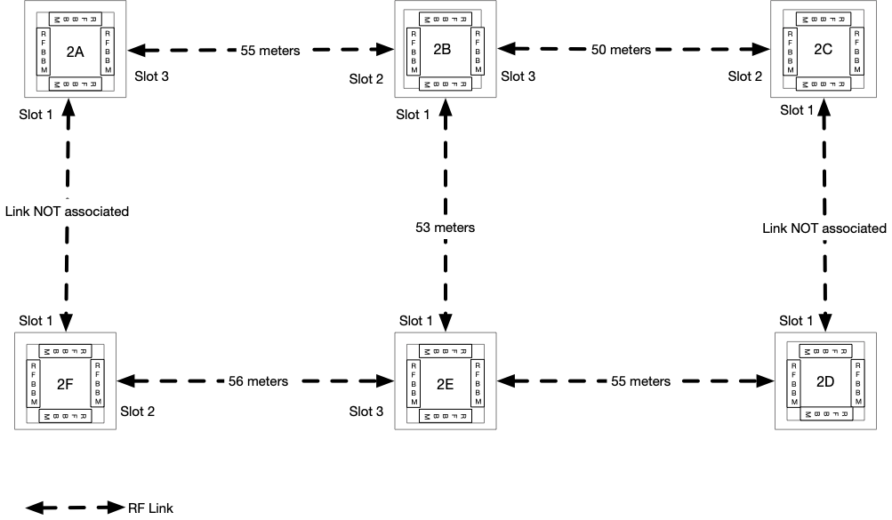

# Throughput Tests

The following will be the tests covered:
* P2P tests
    * These are configured as `TP-P2P.xy` where `x` is the PCI Generation on one
      side and `y` is the PCI generation on the other side (e.g. `TP-TP.32` is
      sending from sector using PCI Generation 3 to a sector using PCIe
      Generation 2)
    * TCP, UDP
* P2MP tests (TCP, UDP and Imix 500, 1500 are layer 3 packet sizes)
    * The P2MP-N tests are configured as follows DN ↔ {DN, N-1 CNs}
    * Modes
        * Burst mode (B)
            * All associations made traffic is solely between DN ↔ DN
        * Average mode (A)
            * All associations made, traffic is evenly distributed between the
              links
        * Overload (O)
            * All associations made, traffic is evenly distributed between the
              links. We push UDP traffic at 150% of the link capacity
* Multi Hop test are configured as `TP-MH.x` where `x` is the number of hops
  (TCP, UDP and Imix 500, 1500 and 1150 are layer 3 packet sizes, Test1: UDP &
  TCP 1500 packet size, Test2: UDP & TCP 500 packet size and Imix), Test2: UDP &
  TCP 1150 packet size
    * Unidirection Multihop test are configured as `TP-MH.x.y.4` where `x` is
      the number of hops, `y` is the MCS rates (packet size 800B). Only have
      done 4 hop and 5 hop.
* Figure H tests are run on a figure 8 with two links not associated as shown
  below. A stream of traffic is sent from 2A ↔ 2D , while simultaneously sending
  a stream from 2F ↔ 2C.

  

Link to throughput chart:

| ANT_CODE        | DUT1 Info | DUT2 Info | laMaxMcs |
|-----------------|-----------|-----------|----------|
| TP_PKTGEN-33.12 | PCIe Gen3 | PCI Gen3  | 12       |
| TP_PKTGEN-33.9  | PCIe Gen3 | PCI Gen3  | 9        |
| TP_PKTGEN-32.11 | PCIe Gen3 | PCI Gen2  | 11       |
| TP_PKTGEN-32.9  | PCIe Gen3 | PCI Gen2  | 9        |
| TP_PKTGEN-22.11 | PCIe Gen2 | PCI Gen2  | 11       |
| TP_PKTGEN-22.9  | PCIe Gen2 | PCI Gen2  | 9        |
