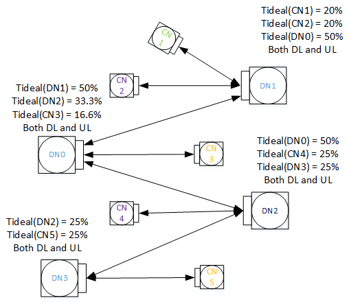

# Z-Street Tests
Test Z-street ignition in different scenarios as mentioned below.

Test Setup: Multihop setup / Z-street setup

## All Tests

### `PUMA_RF_ZS-0.1` Basic Association and Throughput
Description: T_ideal is 50% for each corresponding DN link for both DL/UL/MCS=9
for all the links.

Procedure:
1. Start association in the following steps:
    1. Start association from DN3 to DN1
    2. Start association from DN1 to DN0
    3. Start association from DN0 to DN2
    4. Verify the association is ok by pinging from DN3 to DN2, and it's
       pingable.
2. Start unidirectional UDP/TCP traffic (UDP or TCP, one at a time) from DN3 to
   DN2, and vice versa. Check if the throughput is:
    1. UDP: Offer 862 Mbps, pass with 95% of offered
    2. TCP: Rate-limit to 1000 Mbps, pass with 802 Mbps
    3. Conditional pass = 90% of these thresholds.
3. Run bidirectional UDP/TCP traffic between DN3 and DN2. Check if the
   throughput is at least 400Mbps.
    1. UDP: Offer 400 Mbps, pass with 95% of offered
    2. TCP: Rate-limit to 500 Mbps, pass with 372 Mbps
    3. Conditional pass = 90% of these thresholds

### `PUMA_RF_ZS-1.1` Basic Association
Description: T_ideal as shown/MCS=9 for all the links

Procedure:
1. Start association in the following steps:
    1. Start association from DN0 to DN1, then DN0 to DN2, then DN2 to DN3
    2. Start association from DN0 to CN3
    3. Start association from DN1 to CN1 and CN2
    4. Start association from DN2 to CN4
    5. Start association from DN3 to CN5
    6. Ping from CN1 to other 4 CNs, and make sure they are pingable

  

### `PUMA_RF_ZS-1.2` Throughput to multi-CNs
Description: In this test, we will check simultaneous throughput to all the CNs.
T_ideal as shown/MCS=9 for all the links.

Procedure:
1. Run traffic simultaneously between DN1 and CN1, DN1 and CN2, DN1 and CN3, DN1
   and CN4, and DN1 and CN5 (5 in parallel), UDP and TCP, unidirectional in each
   direction and bidirectional (6 subtests total):
    1. Unidirectional:
        1. UDP: Offer 166 Mbps, pass with 95% of offered (each)
        2. TCP: Rate-limit to 200 Mbps, pass with 155 Mbps (each)
        3. Conditional pass: 90% of the Pass criteria
    2. Bidirectional:
        1. UDP: (same as unidirectional)
        2. TCP: (same as unidirectional)
        3. Conditional pass: 90% of the Pass criteria

### `PUMA_RF_ZS-1.3.1` End-to-End throughput with unidirectional traffic
Description: In this test, we check end-to-end throughput from CN1 to all other
CNs, one at a time. T_ideal as shown/MCS=9 for all the links.

Procedure:
1. Run unidirectional traffic between CN1 and CN2, then between CN1 and CN3,
   then between CN1 and CN4, then between CN1 and CN5, UDP and TCP,
   unidirectional in each direction (16 subtests total):
    1. UDP: Offer 832 Mbps, pass with 95% of offered
    2. TCP: Rate-limit to 1000 Mbps, pass with 775 Mbps
    3. Conditional pass = 90% of the Pass criteria

### `PUMA_RF_ZS-1.3.2` End-to-End throughput with bidirectional traffic
Description: In this test, we check end-to-end throughput from CN1 to all other
CNs, one at a time. T_ideal as shown/MCS=9 for all the links.

Procedure:
1. Run bidirectional traffic between CN1 and CN2, then between CN1 and CN3, then
   between CN1 and CN4, then between CN1 and CN5, UDP and TCP (8 subtests
   total):
    1. UDP: Offer 400 Mbps, pass with 95% of offered
    2. TCP: Rate-limit to 450 Mbps, pass with 372 Mbps
    3. Conditional pass = 90% of the Pass criteria

### `PUMA_RF_ZS-2.1` Error handling
Description: In this test, we will check if network remains operational if we
lose one of the edge DNs (e.g., DN1 or DN3, in the following example, we will
choose DN1). T_ideal as shown/MCS=9 for all the links.

Procedure:
1. In parallel, offer unidirectional iPerf UDP with 400 Mbps push rate from CN3
   to CN4 and from CN5 to CN4 (in parallel), and verify at least 95% of the
   offered traffic is achieved for each flow.
2. Send link down from DN1 to CN1 and CN2, and then from DN0 to DN1.
3. Verify that the two traffic flows still maintain at least 95% of 400 Mbps
   each.
4. Send link up from DN0 to DN1, and verify the two flows still maintain at
   least 95% of 400Mbps each.
5. Associate CN1 and CN2 with DN1. Verify that the throughput for the two flows
   does not change.
6. Start UDP traffic from CN1 to CN3 with 400 Mbps push rate, and verify that
   all three flows achieve at least 95% of 400 Mbps.
